# Wald / Score / LR シミュレーションレポート

- alpha: 0.05
- total rows: 302720
- CI方針: df=1 のとき、各検定のχ²近似を反転した区間を表示 (Score/LR は局所二次近似)。

## Regular: Normal mean (sigma known)

- slug: `normal_mean_known_sigma`
- notes: 正則・解析的に扱える設定。nが増えるとWald/Score/LRはほぼ一致する。
- main: H0: mu = 0 (df=1)

### Summary

| test_label | size | power_at_max_effect | failure_rate | mean_runtime_ms |
| --- | --- | --- | --- | --- |
| lr | 0.058 | 0.990 | 0.000 | 0.074 |
| score | 0.058 | 0.990 | 0.000 | 0.083 |
| wald | 0.058 | 0.990 | 0.000 | 0.108 |

### Inverted CI Summary

| test_label | ci_method | ci_valid_rate | ci_invalid_rate | coverage | left_miss_rate | right_miss_rate | asymmetry_right_minus_left | median_ci_width | mean_ci_width |
| --- | --- | --- | --- | --- | --- | --- | --- | --- | --- |
| lr | inverted_lr_chi2_quadratic | 1.000 | 0.000 | 0.949 | 0.025 | 0.026 | 0.002 | 0.473 | 0.512 |
| score | inverted_score_chi2_linearized | 1.000 | 0.000 | 0.949 | 0.025 | 0.026 | 0.002 | 0.473 | 0.512 |
| wald | inverted_wald_chi2 | 1.000 | 0.000 | 0.949 | 0.025 | 0.026 | 0.002 | 0.473 | 0.512 |

### CI Interpretation

想定: 正則条件下では被覆率は概ね 0.95 に近づき、左右ミス率は近い値になります。不適切行動は少ない想定です。

実測: 目標被覆率は 0.950 です。 被覆率乖離最大: `lr` が 0.949 (差 -0.001)。 左右非対称最大: `lr` で right-left=0.002。 不適切行動(計算不能/無効CI)最大: `lr` の無効率 0.000。

### Interpretation

n の増加に伴い 3 検定が近づくか、どの条件で差が拡大するかを比較するシナリオです。

### Figures

- 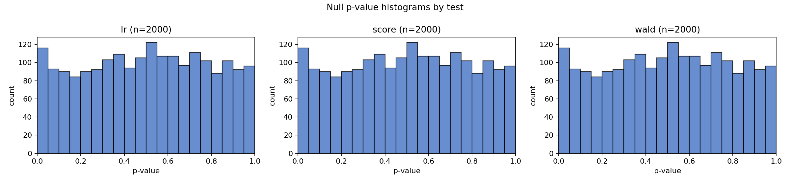
- 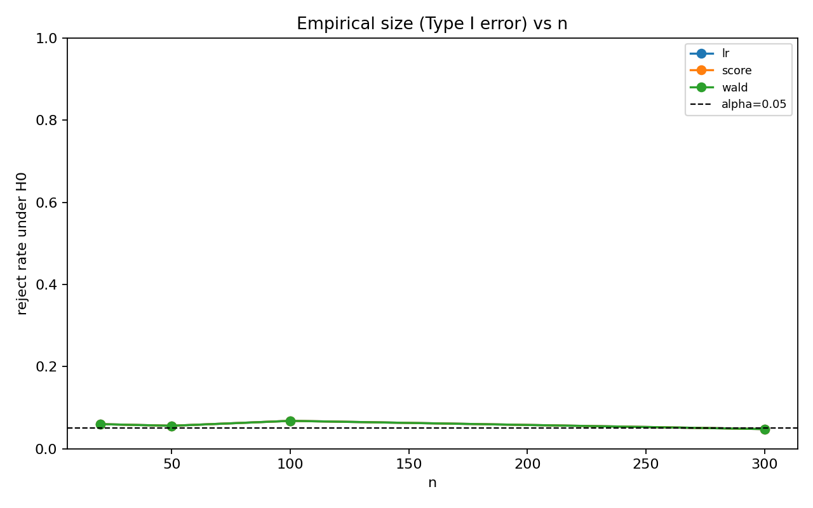
- 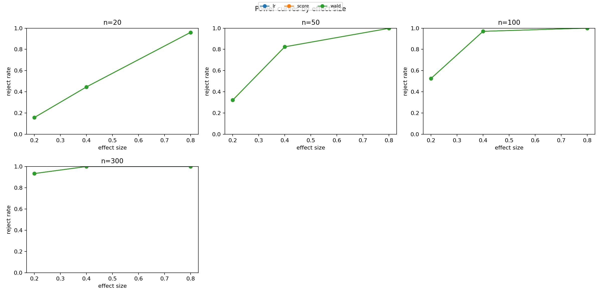
- 
- 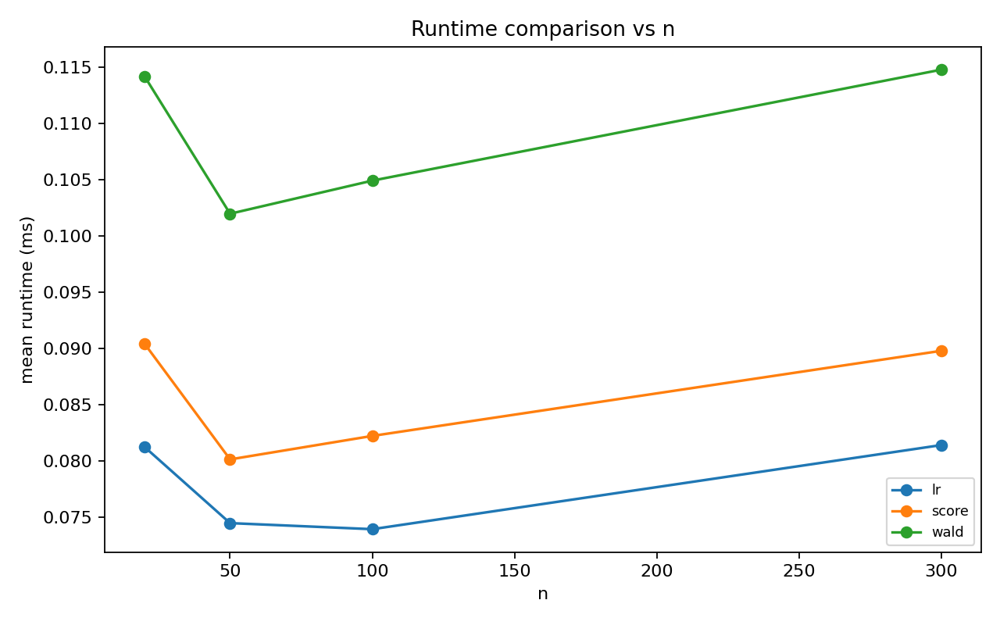

## Regular: Linear regression (single constraint)

- slug: `linear_regression_single_constraint`
- notes: 正則条件下の基礎例。単一・複数制約ともにn増加で3検定が漸近的一致を示す。
- main: H0: beta_1 = 0 (df=1)

### Summary

| test_label | size | power_at_max_effect | failure_rate | mean_runtime_ms |
| --- | --- | --- | --- | --- |
| lr | 0.059 | 0.964 | 0.000 | 0.263 |
| score | 0.056 | 0.959 | 0.000 | 0.196 |
| wald | 0.064 | 0.969 | 0.000 | 0.210 |

### Inverted CI Summary

| test_label | ci_method | ci_valid_rate | ci_invalid_rate | coverage | left_miss_rate | right_miss_rate | asymmetry_right_minus_left | median_ci_width | mean_ci_width |
| --- | --- | --- | --- | --- | --- | --- | --- | --- | --- |
| lr | inverted_lr_chi2_quadratic | 1.000 | 0.000 | 0.948 | 0.031 | 0.021 | -0.010 | 0.423 | 0.464 |
| score | inverted_score_chi2_linearized | 1.000 | 0.000 | 0.954 | 0.029 | 0.017 | -0.012 | 0.437 | 0.479 |
| wald | inverted_wald_chi2 | 1.000 | 0.000 | 0.938 | 0.034 | 0.028 | -0.006 | 0.411 | 0.450 |

### CI Interpretation

想定: 正則条件下では被覆率は概ね 0.95 に近づき、左右ミス率は近い値になります。不適切行動は少ない想定です。

実測: 目標被覆率は 0.950 です。 被覆率乖離最大: `wald` が 0.938 (差 -0.012)。 左右非対称最大: `score` で right-left=-0.012。 不適切行動(計算不能/無効CI)最大: `lr` の無効率 0.000。

### Interpretation

n の増加に伴い 3 検定が近づくか、どの条件で差が拡大するかを比較するシナリオです。

### Figures

- 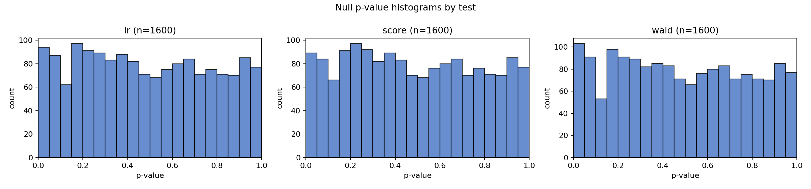
- 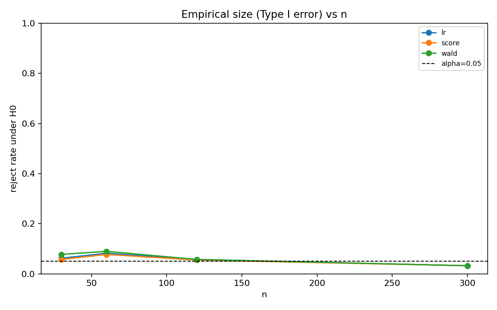
- 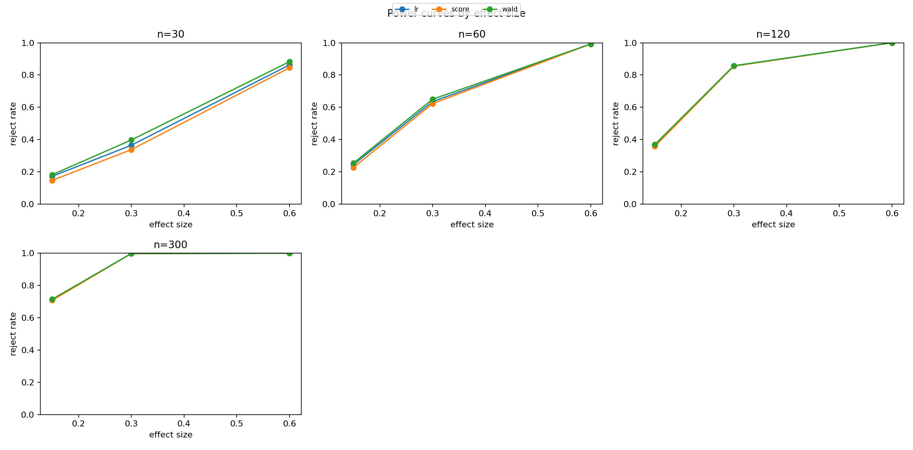
- 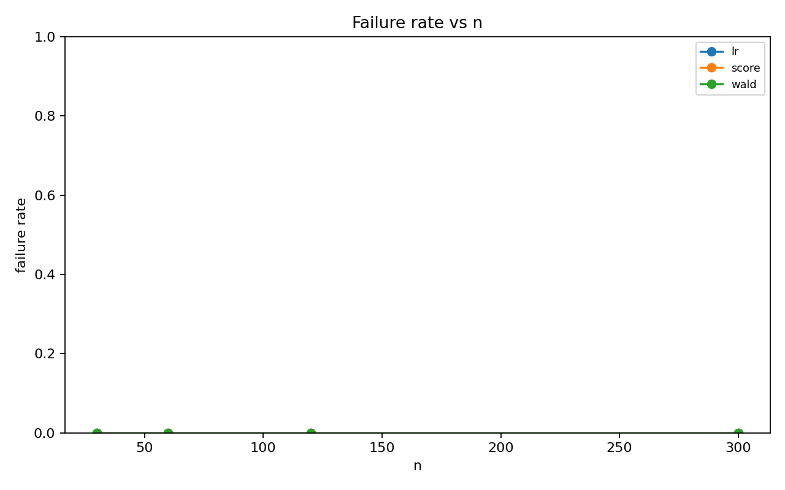
- 

## Regular: Linear regression (multiple constraints)

- slug: `linear_regression_multiple_constraints`
- notes: 正則条件下の基礎例。単一・複数制約ともにn増加で3検定が漸近的一致を示す。
- main: H0: beta_1, beta_2 = 0 (df=2)

### Summary

| test_label | size | power_at_max_effect | failure_rate | mean_runtime_ms |
| --- | --- | --- | --- | --- |
| lr | 0.066 | 0.995 | 0.000 | 0.250 |
| score | 0.058 | 0.991 | 0.000 | 0.186 |
| wald | 0.076 | 0.997 | 0.000 | 0.203 |

### Inverted CI Summary

| test_label | ci_method | ci_valid_rate | ci_invalid_rate | coverage | left_miss_rate | right_miss_rate | asymmetry_right_minus_left | median_ci_width | mean_ci_width |
| --- | --- | --- | --- | --- | --- | --- | --- | --- | --- |
| lr | unsupported_df!=1 | NA | NA | NA | NA | NA | NA | NA | NA |
| score | unsupported_df!=1 | NA | NA | NA | NA | NA | NA | NA | NA |
| wald | unsupported_df!=1 | NA | NA | NA | NA | NA | NA | NA | NA |

### CI Interpretation

想定: この章は df=2 の同時検定なので、単一パラメータの二側CIは対象外 (unsupported_df!=1) です。

実測: 目標被覆率は 0.950 です。

### Interpretation

n の増加に伴い 3 検定が近づくか、どの条件で差が拡大するかを比較するシナリオです。

### Figures

- 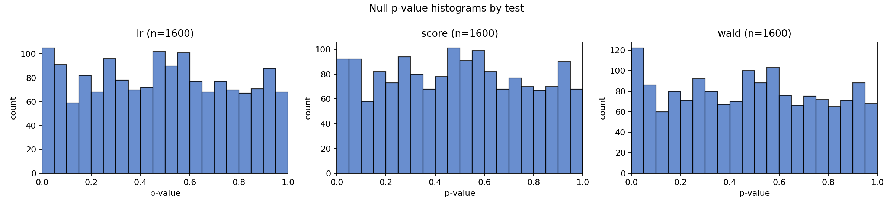
- 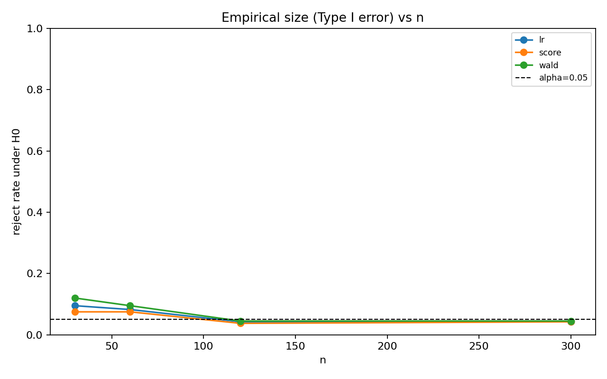
- 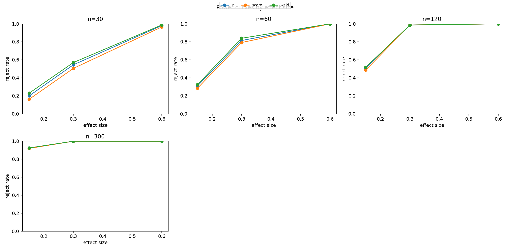
- 
- 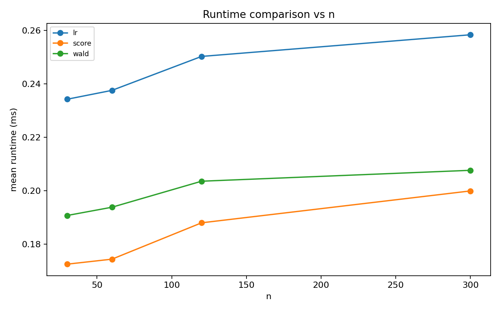

## Separation: Logistic (full MLE unstable)

- slug: `logistic_separation`
- notes: 完全/準分離でfull MLEが壊れるとWald/LRは失敗しやすい。帰無モデル依存のScoreは残りやすい。
- main: H0: beta_1 = 0 (df=1)

### Summary

| test_label | size | power_at_max_effect | failure_rate | mean_runtime_ms |
| --- | --- | --- | --- | --- |
| lr | 0.053 | NA | 0.334 | 2.266 |
| score | 0.050 | 1.000 | 0.000 | 0.865 |
| wald | 0.050 | NA | 0.334 | 1.556 |

### Inverted CI Summary

| test_label | ci_method | ci_valid_rate | ci_invalid_rate | coverage | left_miss_rate | right_miss_rate | asymmetry_right_minus_left | median_ci_width | mean_ci_width |
| --- | --- | --- | --- | --- | --- | --- | --- | --- | --- |
| lr | inverted_lr_chi2_quadratic | 0.666 | 0.334 | 0.478 | 0.018 | 0.503 | 0.485 | 2.168 | 2.857 |
| score | inverted_score_chi2_linearized | 1.000 | 0.000 | 0.328 | 0.008 | 0.664 | 0.656 | 2.045 | 2.157 |
| wald | inverted_wald_chi2 | 0.666 | 0.334 | 0.533 | 0.012 | 0.455 | 0.443 | 2.511 | 1772.059 |

### CI Interpretation

想定: 分離で MLE が発散し、CI の計算不能率が上昇します。有限区間が得られても片側に偏った失敗が起きやすいです。

実測: 目標被覆率は 0.950 です。 被覆率乖離最大: `score` が 0.328 (差 -0.622)。 左右非対称最大: `score` で right-left=0.656。 不適切行動(計算不能/無効CI)最大: `lr` の無効率 0.334。

### Interpretation

分離により full MLE が不安定になり、Wald/LR は失敗率や歪みが増え、Score が相対的に残りやすい設計です。

### Figures

- 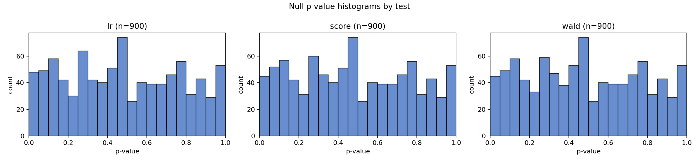
- 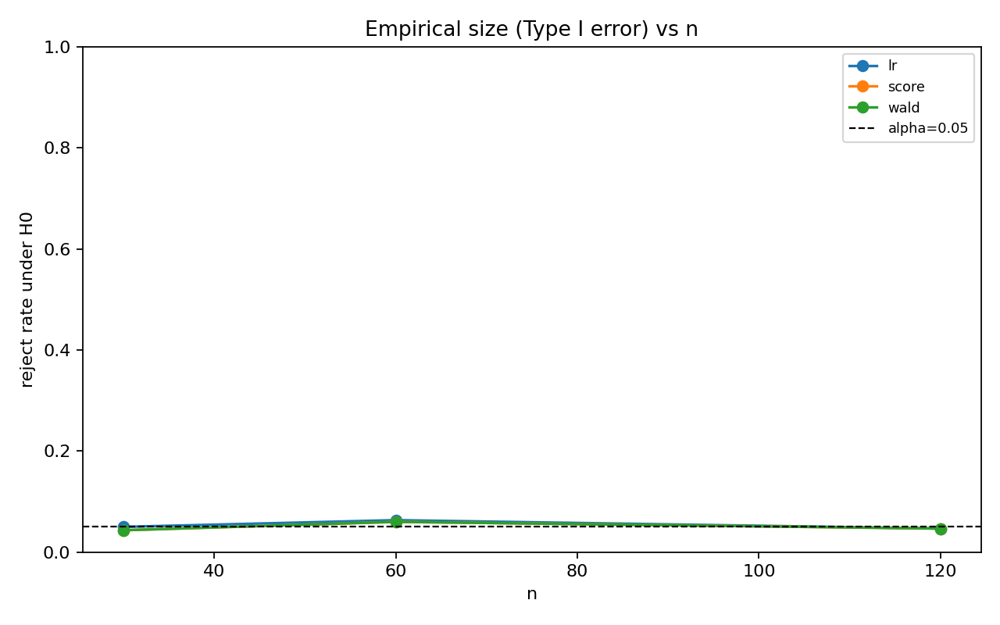
- 
- 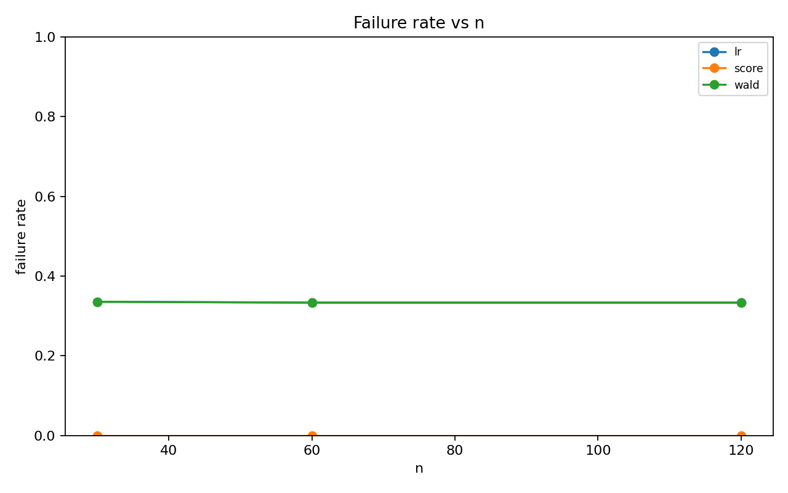
- 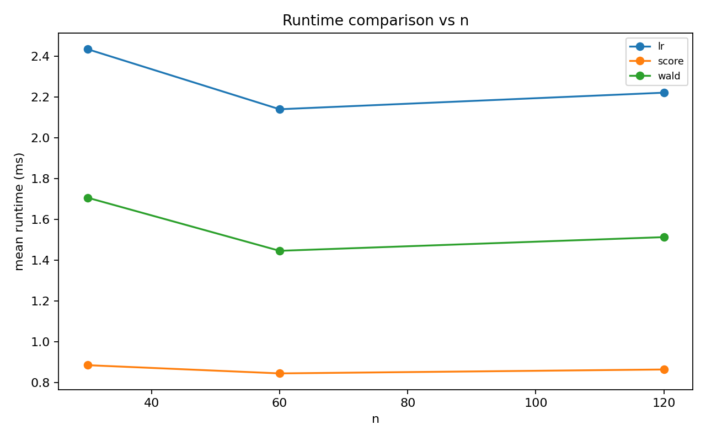

## Finite-sample: Logistic small n

- slug: `logistic_small_sample`
- notes: 小標本では漸近近似誤差でサイズ/パワーに差が出る。n増加で差は縮まる。
- main: H0: beta_1 = 0 (df=1)

### Summary

| test_label | size | power_at_max_effect | failure_rate | mean_runtime_ms |
| --- | --- | --- | --- | --- |
| lr | 0.052 | 0.726 | 0.000 | 1.733 |
| score | 0.049 | 0.711 | 0.000 | 0.848 |
| wald | 0.033 | 0.652 | 0.000 | 1.054 |

### Inverted CI Summary

| test_label | ci_method | ci_valid_rate | ci_invalid_rate | coverage | left_miss_rate | right_miss_rate | asymmetry_right_minus_left | median_ci_width | mean_ci_width |
| --- | --- | --- | --- | --- | --- | --- | --- | --- | --- |
| lr | inverted_lr_chi2_quadratic | 1.000 | 0.000 | 0.932 | 0.029 | 0.038 | 0.009 | 1.121 | 1.290 |
| score | inverted_score_chi2_linearized | 1.000 | 0.000 | 0.954 | 0.031 | 0.015 | -0.016 | 1.059 | 1.203 |
| wald | inverted_wald_chi2 | 1.000 | 0.000 | 0.961 | 0.024 | 0.015 | -0.009 | 1.188 | 1.393 |

### CI Interpretation

想定: 小標本近似誤差で被覆率が名目からずれ、左右非対称なミス率が出る可能性があります。

実測: 目標被覆率は 0.950 です。 被覆率乖離最大: `lr` が 0.932 (差 -0.018)。 左右非対称最大: `score` で right-left=-0.016。 不適切行動(計算不能/無効CI)最大: `lr` の無効率 0.000。

### Interpretation

n の増加に伴い 3 検定が近づくか、どの条件で差が拡大するかを比較するシナリオです。

### Figures

- 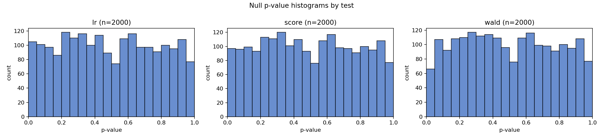
- 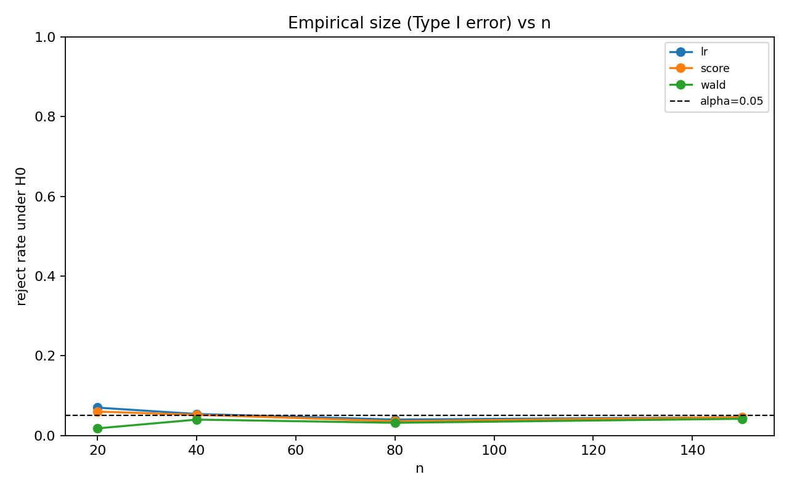
- 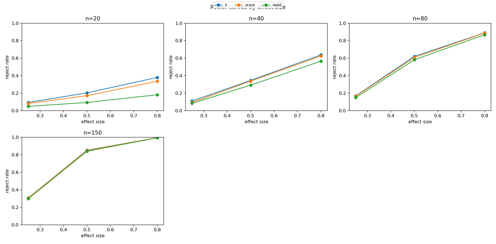
- 
- 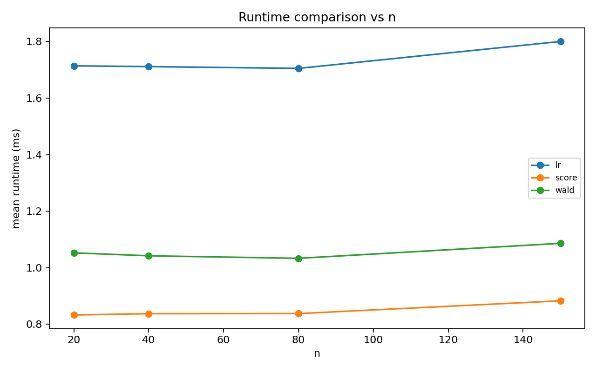

## Practical: Wald batch speed for many hypotheses

- slug: `wald_runtime_batch`
- notes: When many hypotheses are tested from one shared full fit, Wald can be much faster than re-fitting null models for LR/Score.
- beta_1: H0: beta_1 = 0 (df=1)
- beta_2: H0: beta_2 = 0 (df=1)
- beta_3: H0: beta_3 = 0 (df=1)
- beta_4: H0: beta_4 = 0 (df=1)
- beta_5: H0: beta_5 = 0 (df=1)
- beta_6: H0: beta_6 = 0 (df=1)
- beta_7: H0: beta_7 = 0 (df=1)
- beta_8: H0: beta_8 = 0 (df=1)
- beta_9: H0: beta_9 = 0 (df=1)
- beta_10: H0: beta_10 = 0 (df=1)

### Summary

| test_label | size | power_at_max_effect | failure_rate | mean_runtime_ms |
| --- | --- | --- | --- | --- |
| lr | 0.074 | 0.523 | 0.000 | 0.470 |
| score | 0.072 | 0.521 | 0.000 | 0.531 |
| wald | 0.077 | 0.524 | 0.000 | 0.161 |

### Inverted CI Summary

| test_label | ci_method | ci_valid_rate | ci_invalid_rate | coverage | left_miss_rate | right_miss_rate | asymmetry_right_minus_left | median_ci_width | mean_ci_width |
| --- | --- | --- | --- | --- | --- | --- | --- | --- | --- |
| lr | inverted_lr_chi2_quadratic | 1.000 | 0.000 | 0.927 | 0.038 | 0.034 | -0.004 | 0.321 | 0.331 |
| score | inverted_score_chi2_linearized | 1.000 | 0.000 | 0.931 | 0.037 | 0.032 | -0.005 | 0.324 | 0.335 |
| wald | inverted_wald_chi2 | 1.000 | 0.000 | 0.923 | 0.040 | 0.037 | -0.003 | 0.318 | 0.328 |

### CI Interpretation

想定: 条件が悪化するほど被覆率低下・左右非対称化・計算不能増加が起きやすくなります。

実測: 目標被覆率は 0.950 です。 被覆率乖離最大: `wald` が 0.923 (差 -0.027)。 左右非対称最大: `score` で right-left=-0.005。 不適切行動(計算不能/無効CI)最大: `lr` の無効率 0.000。

### Interpretation

複数仮説を同一 full fit で処理できるため、Wald の実務上の速度優位を確認するシナリオです。

### Figures

- 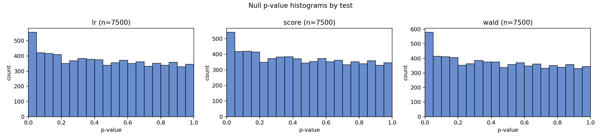
- 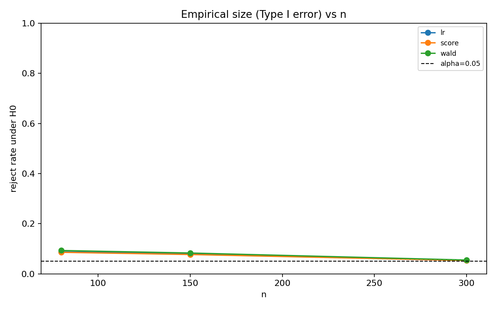
- 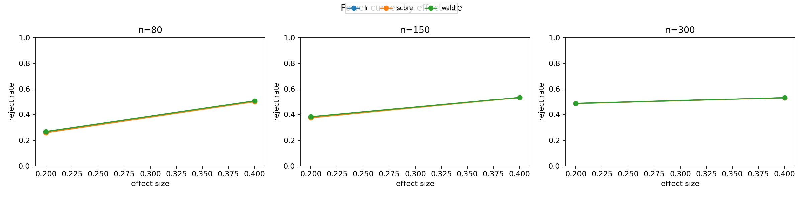
- 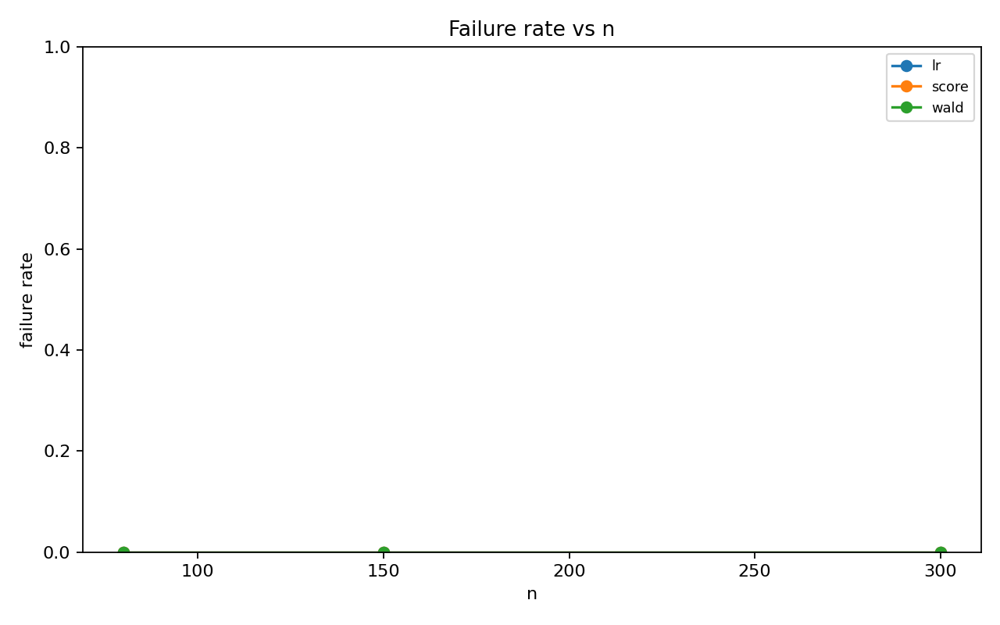
- 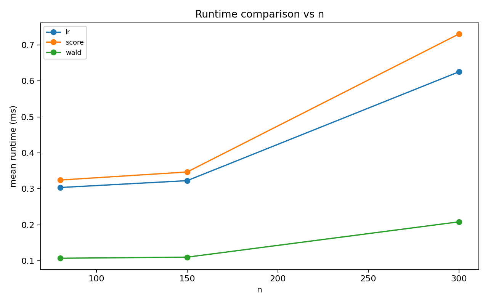

## Non-regular: ZIP boundary H0: pi=0

- slug: `zip_boundary`
- notes: 境界仮説でχ²近似が壊れ、Wald/Score/LRすべてサイズが歪み得る。LRのparametric bootstrapで校正可能。
- main: H0: pi = 0 (boundary) (df=1)

### Summary

| test_label | size | power_at_max_effect | failure_rate | mean_runtime_ms |
| --- | --- | --- | --- | --- |
| lr | 0.019 | 0.531 | 0.000 | 4.423 |
| lr_bootstrap | 0.013 | 0.469 | 0.000 | 204.809 |
| score | 0.031 | 0.531 | 0.000 | 0.222 |
| wald | 0.019 | 0.600 | 0.000 | 4.510 |

### Inverted CI Summary

| test_label | ci_method | ci_valid_rate | ci_invalid_rate | coverage | left_miss_rate | right_miss_rate | asymmetry_right_minus_left | median_ci_width | mean_ci_width |
| --- | --- | --- | --- | --- | --- | --- | --- | --- | --- |
| lr | inverted_lr_chi2_quadratic | 1.000 | 0.000 | 0.929 | 0.048 | 0.023 | -0.025 | 0.316 | 0.284 |
| lr_bootstrap | NA | 0.000 | 1.000 | NA | NA | NA | NA | NA | NA |
| score | inverted_score_chi2_linearized | 1.000 | 0.000 | 0.954 | 0.013 | 0.033 | 0.021 | 0.376 | 0.396 |
| wald | inverted_wald_chi2 | 1.000 | 0.000 | 0.921 | 0.048 | 0.031 | -0.017 | 0.295 | 0.264 |

### CI Interpretation

想定: 境界問題で二側対称CIの仮定が壊れ、被覆率悪化や下限の不自然な挙動が起きます。bootstrap 系の補正が必要です。

実測: 目標被覆率は 0.950 です。 被覆率乖離最大: `wald` が 0.921 (差 -0.029)。 左右非対称最大: `lr` で right-left=-0.025。 不適切行動(計算不能/無効CI)最大: `lr_bootstrap` の無効率 1.000。

### Interpretation

境界帰無では通常のχ²近似が崩れるため、naive な p 値はサイズを外しやすく、bootstrap 補正の有効性を見るシナリオです。

### Figures

- 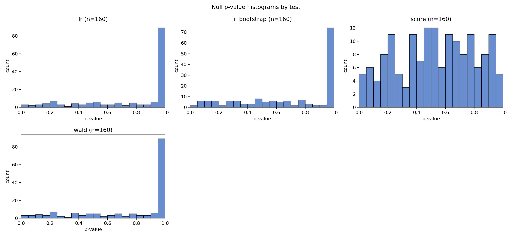
- 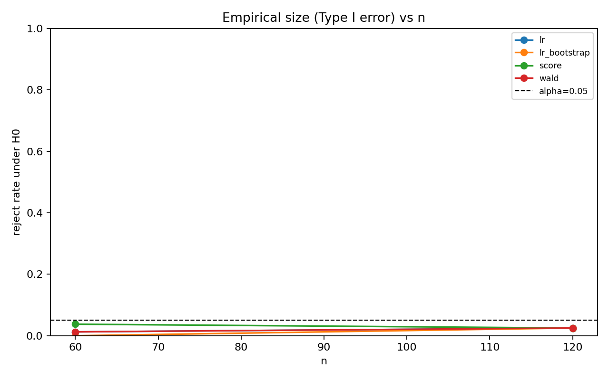
- 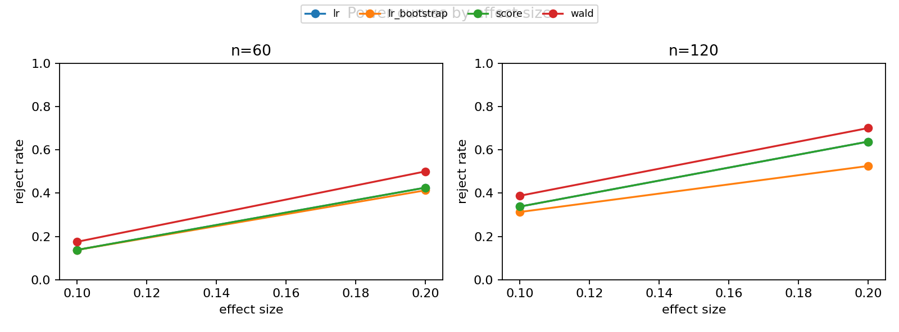
- 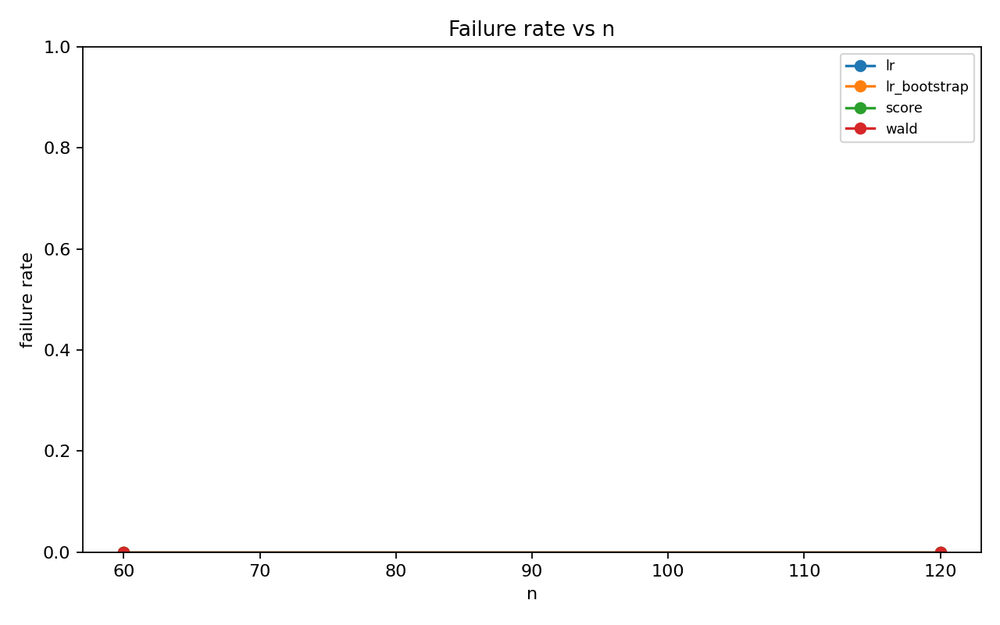
- 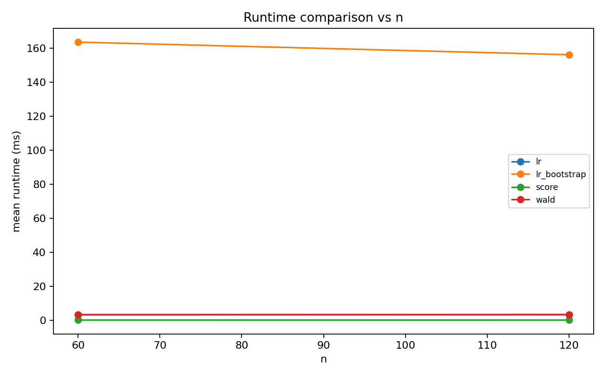

## Weak identification: severe collinearity

- slug: `collinearity`
- notes: 強共線性で情報行列がほぼ特異となり、分散推定不安定や失敗率上昇が起こる。
- main: H0: beta_1 = 0 (df=1)

### Summary

| test_label | size | power_at_max_effect | failure_rate | mean_runtime_ms |
| --- | --- | --- | --- | --- |
| lr | NA | NA | 1.000 | 0.204 |
| score | 0.056 | 0.061 | 0.338 | 0.209 |
| wald | NA | NA | 1.000 | 0.086 |

### Inverted CI Summary

| test_label | ci_method | ci_valid_rate | ci_invalid_rate | coverage | left_miss_rate | right_miss_rate | asymmetry_right_minus_left | median_ci_width | mean_ci_width |
| --- | --- | --- | --- | --- | --- | --- | --- | --- | --- |
| lr | NA | 0.000 | 1.000 | NA | NA | NA | NA | NA | NA |
| score | inverted_score_chi2_linearized | 0.662 | 0.338 | 0.943 | 0.025 | 0.032 | 0.007 | 30429675.178 | 44557349.935 |
| wald | NA | 0.000 | 1.000 | NA | NA | NA | NA | NA | NA |

### CI Interpretation

想定: 情報行列のほぼ特異性により区間幅の不安定化・失敗率上昇が起き、過大/過小被覆の混在が起こり得ます。

実測: 目標被覆率は 0.950 です。 被覆率乖離最大: `score` が 0.943 (差 -0.007)。 左右非対称最大: `score` で right-left=0.007。 不適切行動(計算不能/無効CI)最大: `lr` の無効率 1.000。

### Interpretation

n の増加に伴い 3 検定が近づくか、どの条件で差が拡大するかを比較するシナリオです。

### Figures

- 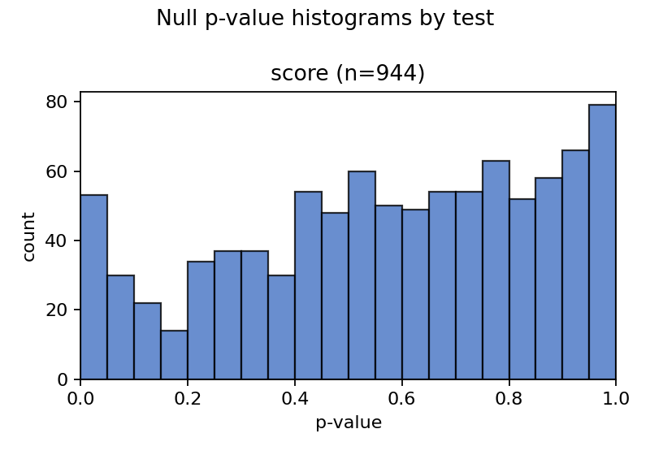
- 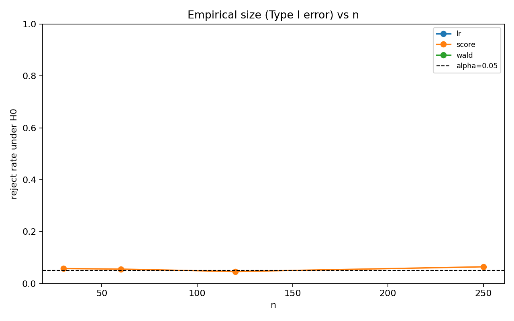
- 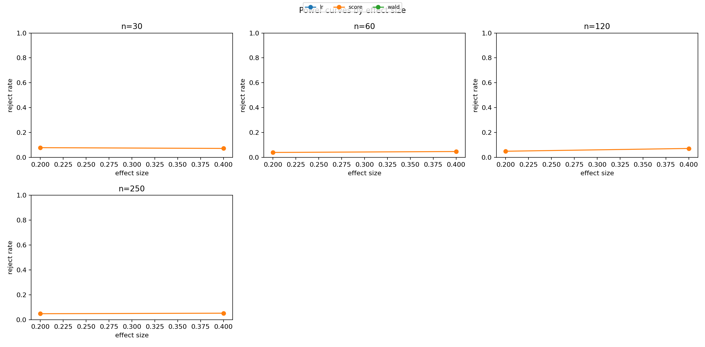
- 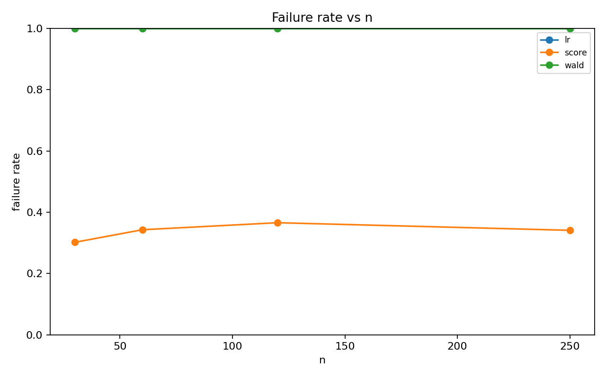
- 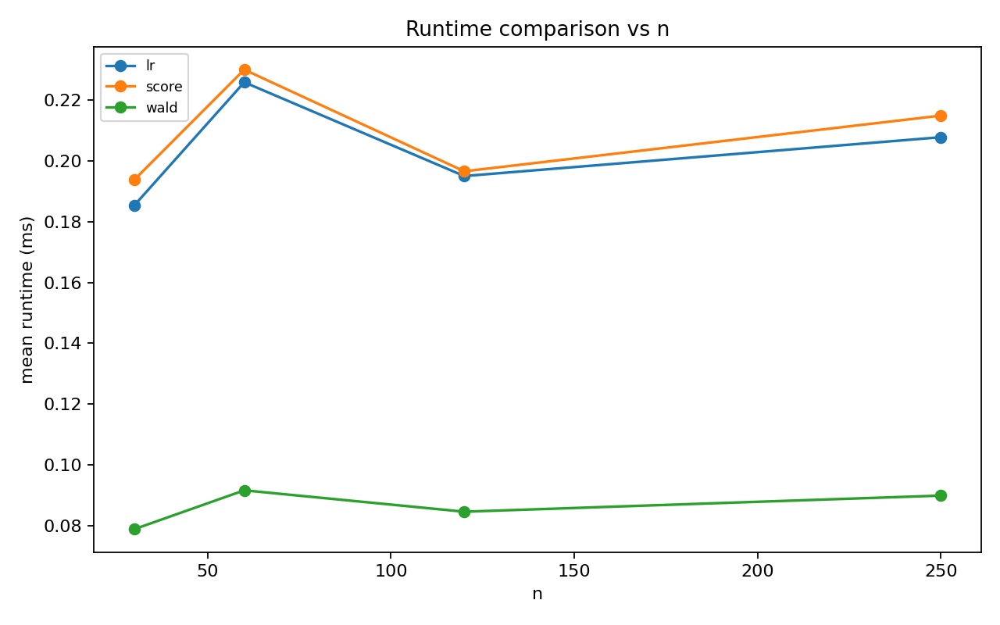

## Misspecification: True NegBin, fitted Poisson

- slug: `poisson_misspec`
- notes: 真の分布が過分散なのにPoisson仮定で推定。3検定が同時にサイズ崩壊する例。
- main: H0: beta_1 = 0 (df=1)

### Summary

| test_label | size | power_at_max_effect | failure_rate | mean_runtime_ms |
| --- | --- | --- | --- | --- |
| lr | 0.189 | 0.989 | 0.000 | 1.811 |
| score | 0.189 | 0.989 | 0.000 | 0.896 |
| wald | 0.189 | 0.989 | 0.000 | 1.083 |

### Inverted CI Summary

| test_label | ci_method | ci_valid_rate | ci_invalid_rate | coverage | left_miss_rate | right_miss_rate | asymmetry_right_minus_left | median_ci_width | mean_ci_width |
| --- | --- | --- | --- | --- | --- | --- | --- | --- | --- |
| lr | inverted_lr_chi2_quadratic | 1.000 | 0.000 | 0.758 | 0.125 | 0.118 | -0.007 | 0.307 | 0.344 |
| score | inverted_score_chi2_linearized | 1.000 | 0.000 | 0.755 | 0.127 | 0.118 | -0.009 | 0.306 | 0.342 |
| wald | inverted_wald_chi2 | 1.000 | 0.000 | 0.758 | 0.124 | 0.118 | -0.007 | 0.306 | 0.346 |

### CI Interpretation

想定: 分布ミススペックでモデルベースSEが不適切になり、被覆率低下や片側ミス偏りが起きやすいです。

実測: 目標被覆率は 0.950 です。 被覆率乖離最大: `score` が 0.755 (差 -0.195)。 左右非対称最大: `score` で right-left=-0.009。 不適切行動(計算不能/無効CI)最大: `lr` の無効率 0.000。

### Interpretation

n の増加に伴い 3 検定が近づくか、どの条件で差が拡大するかを比較するシナリオです。

### Figures

- 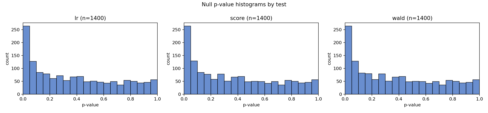
- 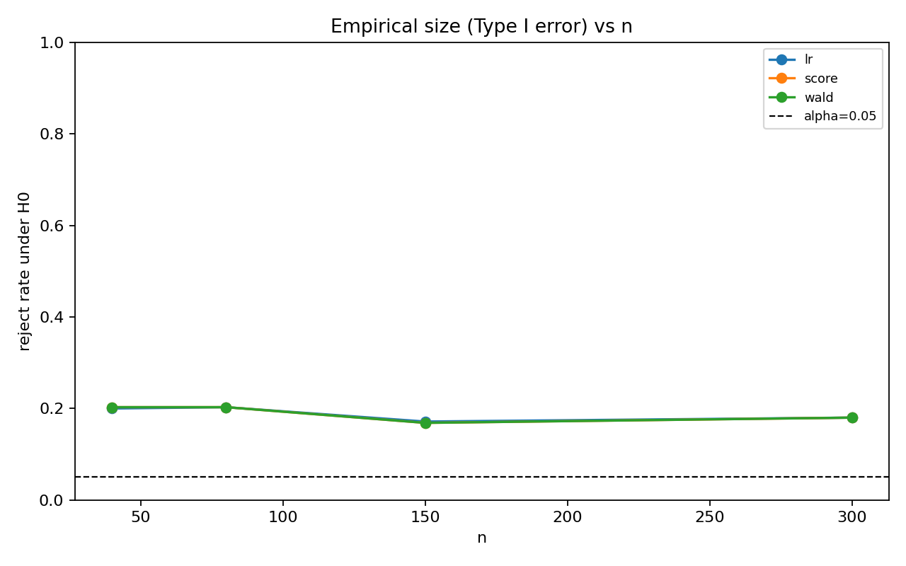
- 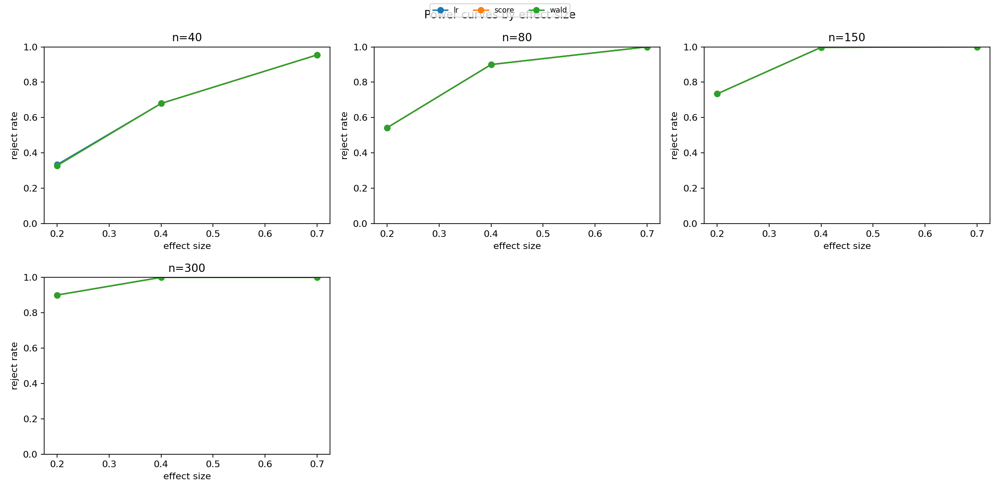
- 
- 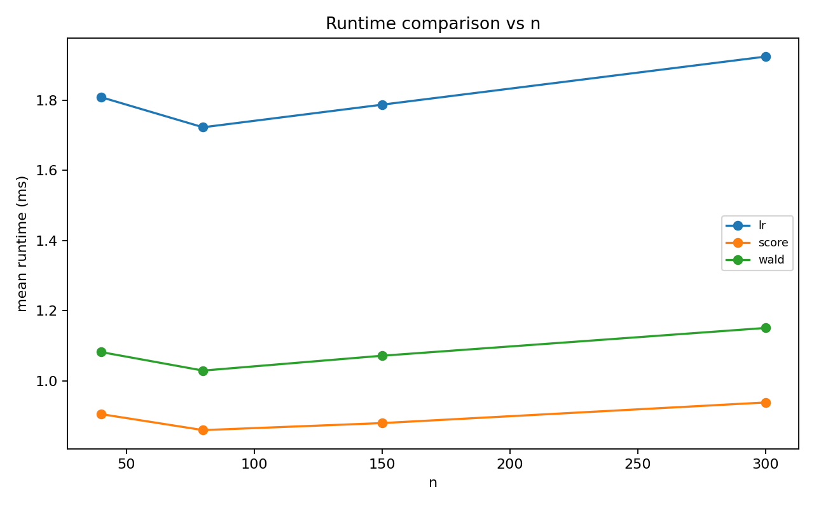

## Invariance demo: beta=0 vs OR=1

- slug: `invariance_demo`
- notes: Wald can differ across equivalent parameterizations (beta vs OR), while LR is comparatively stable to reparameterization because it compares likelihood values.
- beta: H0: beta_1 = 0 (df=1)
- or: H0: OR = 1 (df=1)

### Summary

| test_label | size | power_at_max_effect | failure_rate | mean_runtime_ms |
| --- | --- | --- | --- | --- |
| lr:beta | 0.068 | 0.736 | 0.000 | 1.706 |
| score:beta | 0.062 | 0.719 | 0.000 | 0.850 |
| wald:beta | 0.048 | 0.688 | 0.000 | 1.019 |
| wald:or | 0.067 | 0.422 | 0.000 | 1.019 |

### Inverted CI Summary

| test_label | ci_method | ci_valid_rate | ci_invalid_rate | coverage | left_miss_rate | right_miss_rate | asymmetry_right_minus_left | median_ci_width | mean_ci_width |
| --- | --- | --- | --- | --- | --- | --- | --- | --- | --- |
| lr:beta | inverted_lr_chi2_quadratic | 1.000 | 0.000 | 0.934 | 0.028 | 0.038 | 0.009 | 0.996 | 1.126 |
| score:beta | inverted_score_chi2_linearized | 1.000 | 0.000 | 0.955 | 0.029 | 0.017 | -0.012 | 0.950 | 1.067 |
| wald:beta | inverted_wald_chi2 | 1.000 | 0.000 | 0.959 | 0.023 | 0.018 | -0.005 | 1.048 | 1.191 |
| wald:or | inverted_wald_chi2 | 1.000 | 0.000 | 0.938 | 0.060 | 0.002 | -0.058 | 1.362 | 2.708 |

### CI Interpretation

想定: Wald はパラメータ化依存で被覆や左右ミス率が変化し得ます。同値仮説でも区間形状が一致しない点に注意が必要です。

実測: 目標被覆率は 0.950 です。 被覆率乖離最大: `lr:beta` が 0.934 (差 -0.016)。 左右非対称最大: `wald:or` で right-left=-0.058。 不適切行動(計算不能/無効CI)最大: `lr:beta` の無効率 0.000。

### Interpretation

n の増加に伴い 3 検定が近づくか、どの条件で差が拡大するかを比較するシナリオです。

### Figures

- 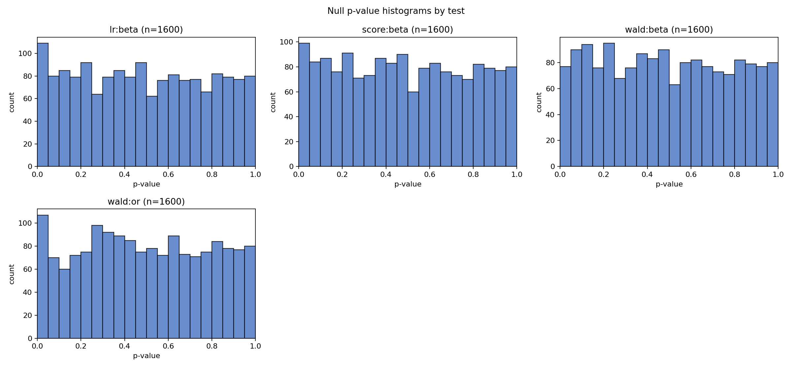
- 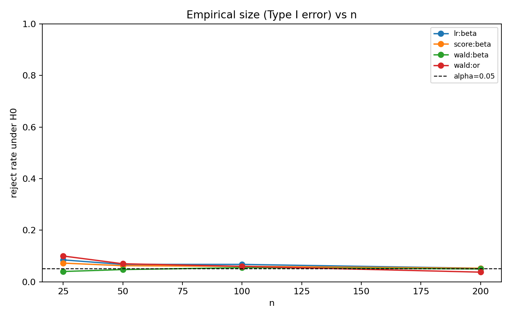
- 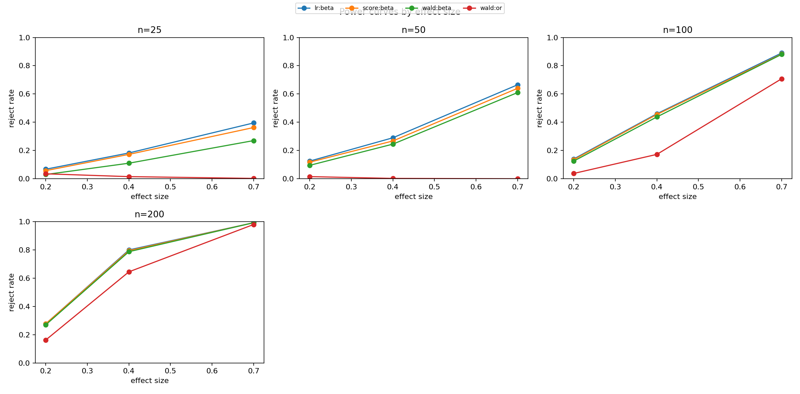
- 
- 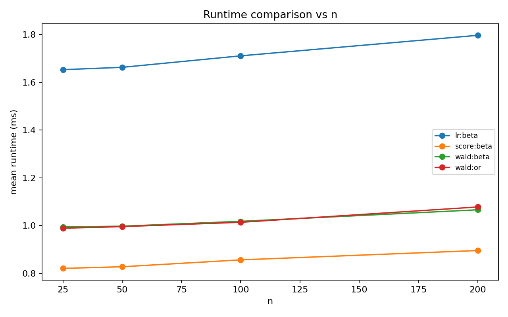

## Overfitting/p-hacking: stepwise then test

- slug: `phacking_stepwise`
- notes: Variable selection and testing on the same sample inflates false positives. Sample splitting reduces this bias at the cost of power.
- same_data: H0: selected beta = 0 (selection and testing on same data) (df=1)
- split_data: H0: selected beta = 0 (selection on train, testing on test split) (df=1)

### Summary

| test_label | size | power_at_max_effect | failure_rate | mean_runtime_ms |
| --- | --- | --- | --- | --- |
| lr:same_data | 0.663 | 0.663 | 0.000 | 0.233 |
| lr:split_data | 0.062 | 0.062 | 0.000 | 0.230 |
| score:same_data | 0.653 | 0.653 | 0.000 | 0.173 |
| score:split_data | 0.058 | 0.058 | 0.000 | 0.172 |
| wald:same_data | 0.677 | 0.677 | 0.000 | 0.207 |
| wald:split_data | 0.065 | 0.065 | 0.000 | 0.197 |

### Inverted CI Summary

| test_label | ci_method | ci_valid_rate | ci_invalid_rate | coverage | left_miss_rate | right_miss_rate | asymmetry_right_minus_left | median_ci_width | mean_ci_width |
| --- | --- | --- | --- | --- | --- | --- | --- | --- | --- |
| lr:same_data | inverted_lr_chi2_quadratic | 1.000 | 0.000 | 0.337 | 0.336 | 0.327 | -0.009 | 0.309 | 0.321 |
| lr:split_data | inverted_lr_chi2_quadratic | 1.000 | 0.000 | 0.938 | 0.033 | 0.029 | -0.003 | 0.434 | 0.461 |
| score:same_data | inverted_score_chi2_linearized | 1.000 | 0.000 | 0.347 | 0.330 | 0.323 | -0.007 | 0.311 | 0.325 |
| score:split_data | inverted_score_chi2_linearized | 1.000 | 0.000 | 0.942 | 0.031 | 0.027 | -0.005 | 0.436 | 0.463 |
| wald:same_data | inverted_wald_chi2 | 1.000 | 0.000 | 0.323 | 0.343 | 0.333 | -0.010 | 0.308 | 0.318 |
| wald:split_data | inverted_wald_chi2 | 1.000 | 0.000 | 0.935 | 0.034 | 0.031 | -0.003 | 0.432 | 0.459 |

### CI Interpretation

想定: 同一データ選択では区間が過度に楽観的になり被覆率が低下します。split では改善する一方で幅は広がりやすいです。

実測: 目標被覆率は 0.950 です。 被覆率乖離最大: `wald:same_data` が 0.323 (差 -0.627)。 左右非対称最大: `wald:same_data` で right-left=-0.010。 不適切行動(計算不能/無効CI)最大: `lr:same_data` の無効率 0.000。

### Interpretation

同一データで変数選択と検定を行うと size が膨らみ、サンプルスプリットで緩和されることを確認するシナリオです。

### Figures

- 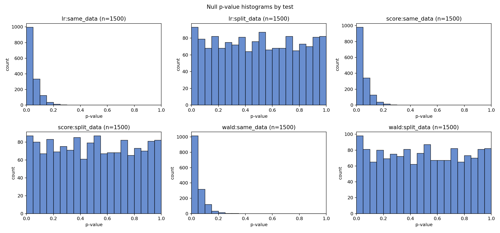
- 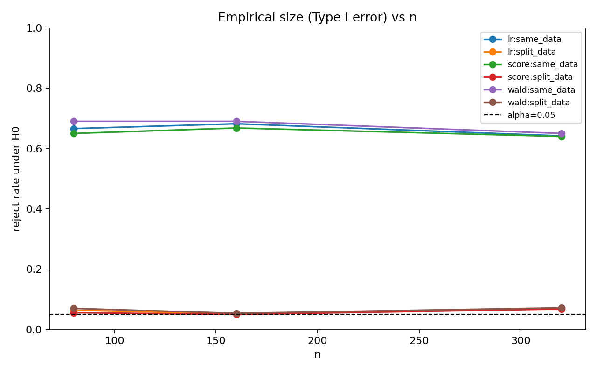
- 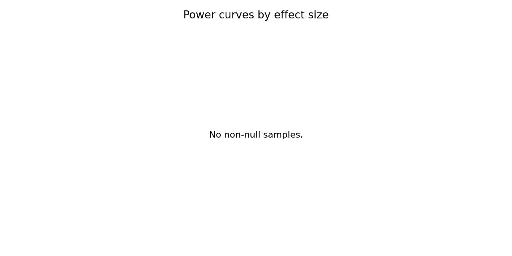
- 
- 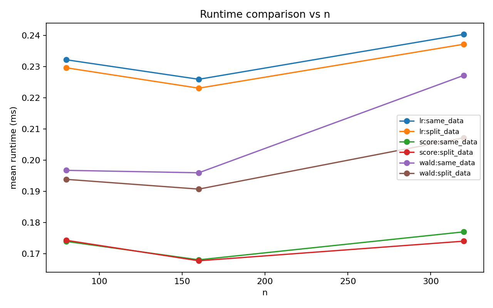

## Misspecification: Linear regression heteroskedastic

- slug: `linear_regression_heteroskedastic`
- notes: Heteroskedastic errors violate the constant-variance likelihood assumption, so nominal size can drift for Wald/Score/LR under the homoskedastic model. HC3-robust Wald can partially recover calibration.
- main: H0: beta_1 = 0 (df=1)

### Summary

| test_label | size | power_at_max_effect | failure_rate | mean_runtime_ms |
| --- | --- | --- | --- | --- |
| lr | 0.194 | 0.869 | 0.000 | 0.266 |
| score | 0.190 | 0.865 | 0.000 | 0.206 |
| wald | 0.204 | 0.871 | 0.000 | 0.215 |
| wald_hc3 | 0.051 | 0.756 | 0.000 | 0.384 |

### Inverted CI Summary

| test_label | ci_method | ci_valid_rate | ci_invalid_rate | coverage | left_miss_rate | right_miss_rate | asymmetry_right_minus_left | median_ci_width | mean_ci_width |
| --- | --- | --- | --- | --- | --- | --- | --- | --- | --- |
| lr | inverted_lr_chi2_quadratic | 1.000 | 0.000 | 0.797 | 0.106 | 0.097 | -0.009 | 0.635 | 0.697 |
| score | inverted_score_chi2_linearized | 1.000 | 0.000 | 0.808 | 0.105 | 0.086 | -0.019 | 0.650 | 0.713 |
| wald | inverted_wald_chi2 | 1.000 | 0.000 | 0.782 | 0.108 | 0.110 | 0.002 | 0.622 | 0.681 |
| wald_hc3 | inverted_wald_hc3_chi2 | 1.000 | 0.000 | 0.938 | 0.031 | 0.031 | -0.000 | 0.935 | 1.057 |

### CI Interpretation

想定: 等分散仮定の Wald/Score/LR は被覆率が崩れやすく、左右ミス率が偏る可能性があります。`wald_hc3` は被覆率改善が期待されます。

実測: 目標被覆率は 0.950 です。 被覆率乖離最大: `wald` が 0.782 (差 -0.168)。 左右非対称最大: `score` で right-left=-0.019。 不適切行動(計算不能/無効CI)最大: `lr` の無効率 0.000。

### Interpretation

n の増加に伴い 3 検定が近づくか、どの条件で差が拡大するかを比較するシナリオです。

### Figures

- 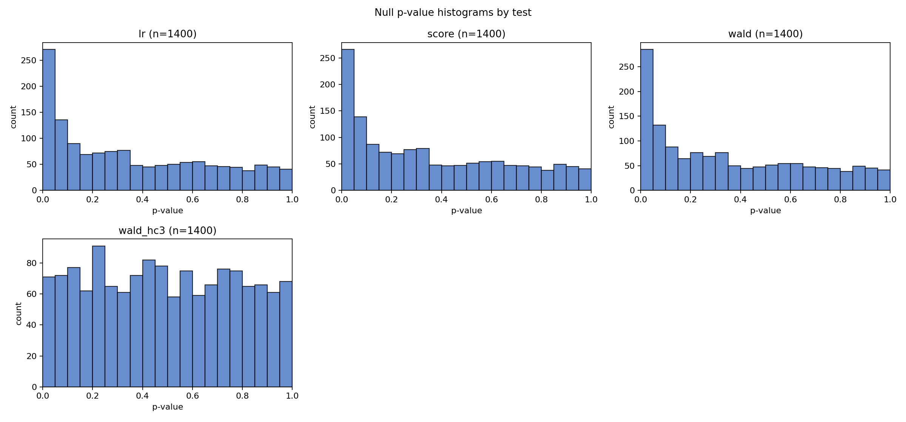
- 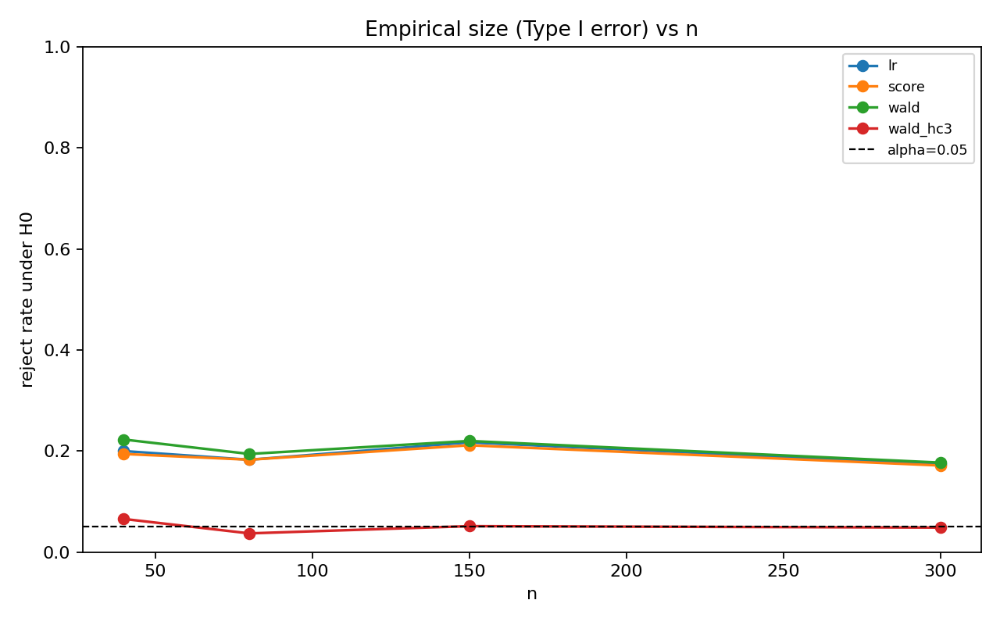
- 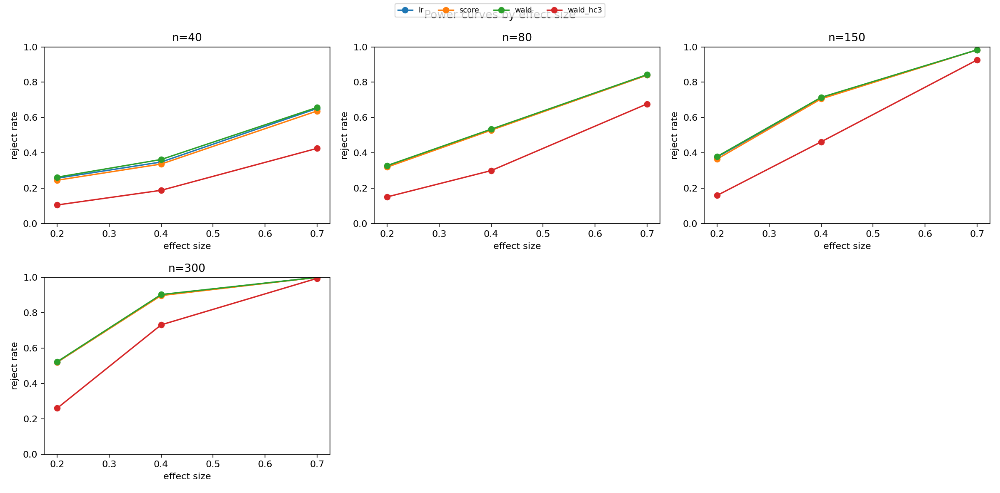
- 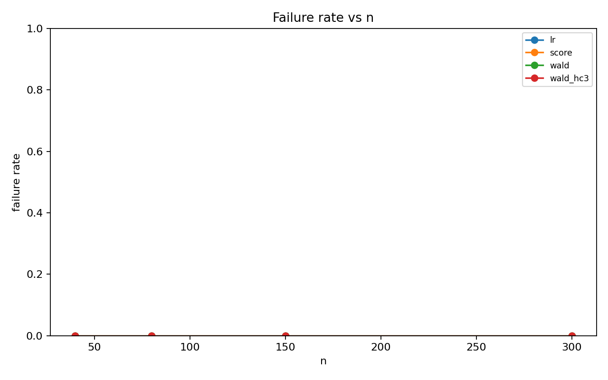
- 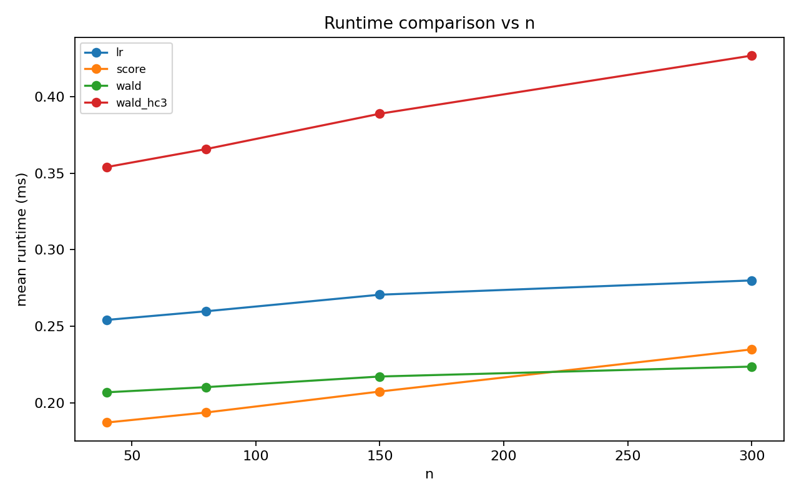

## Dependence: Logistic with clustered outcomes

- slug: `logistic_clustered`
- notes: Clustered dependence violates the independent-observation information matrix, so naive Wald/Score/LR under an iid logit can over-reject. Cluster-robust Wald can improve size calibration.
- main: H0: beta_1 = 0 (df=1)

### Summary

| test_label | size | power_at_max_effect | failure_rate | mean_runtime_ms |
| --- | --- | --- | --- | --- |
| lr | 0.052 | 0.870 | 0.000 | 2.336 |
| score | 0.044 | 0.859 | 0.000 | 1.159 |
| wald | 0.039 | 0.850 | 0.000 | 1.397 |
| wald_cluster | 0.074 | 0.843 | 0.000 | 1.753 |

### Inverted CI Summary

| test_label | ci_method | ci_valid_rate | ci_invalid_rate | coverage | left_miss_rate | right_miss_rate | asymmetry_right_minus_left | median_ci_width | mean_ci_width |
| --- | --- | --- | --- | --- | --- | --- | --- | --- | --- |
| lr | inverted_lr_chi2_quadratic | 1.000 | 0.000 | 0.911 | 0.068 | 0.021 | -0.047 | 0.801 | 0.888 |
| score | inverted_score_chi2_linearized | 1.000 | 0.000 | 0.896 | 0.095 | 0.008 | -0.087 | 0.766 | 0.845 |
| wald | inverted_wald_chi2 | 1.000 | 0.000 | 0.929 | 0.062 | 0.009 | -0.053 | 0.841 | 0.935 |
| wald_cluster | inverted_wald_cluster_chi2 | 1.000 | 0.000 | 0.901 | 0.077 | 0.022 | -0.055 | 0.774 | 0.909 |

### CI Interpretation

想定: 独立仮定の推論は過小SEにより被覆率が低下しやすく、過剰棄却を起こしやすいです。`wald_cluster` は補正で改善が期待されます。

実測: 目標被覆率は 0.950 です。 被覆率乖離最大: `score` が 0.896 (差 -0.054)。 左右非対称最大: `score` で right-left=-0.087。 不適切行動(計算不能/無効CI)最大: `lr` の無効率 0.000。

### Interpretation

n の増加に伴い 3 検定が近づくか、どの条件で差が拡大するかを比較するシナリオです。

### Figures

- 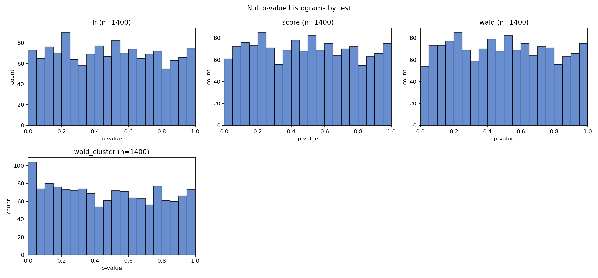
- 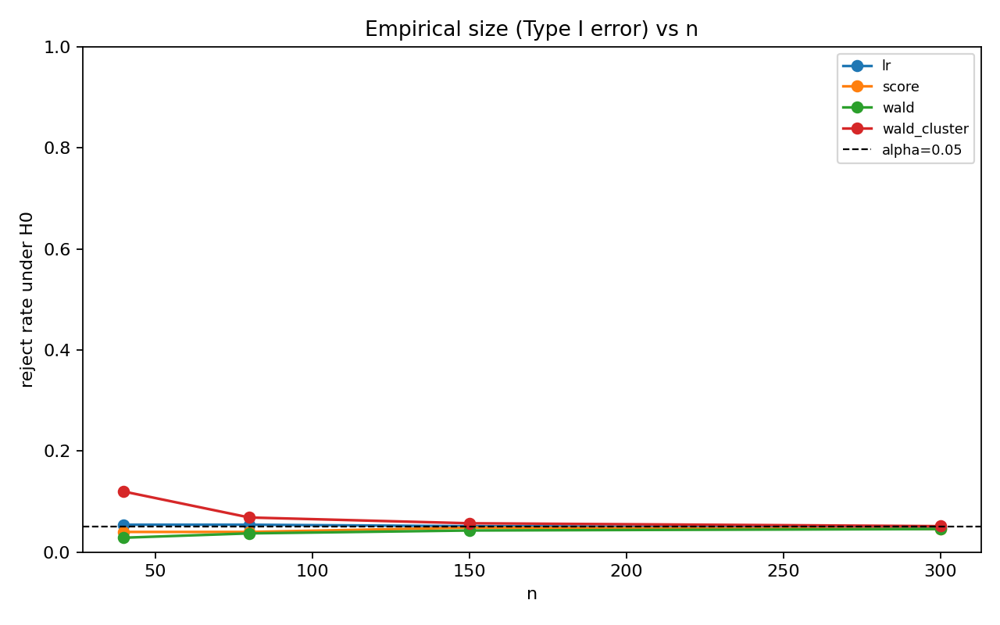
- 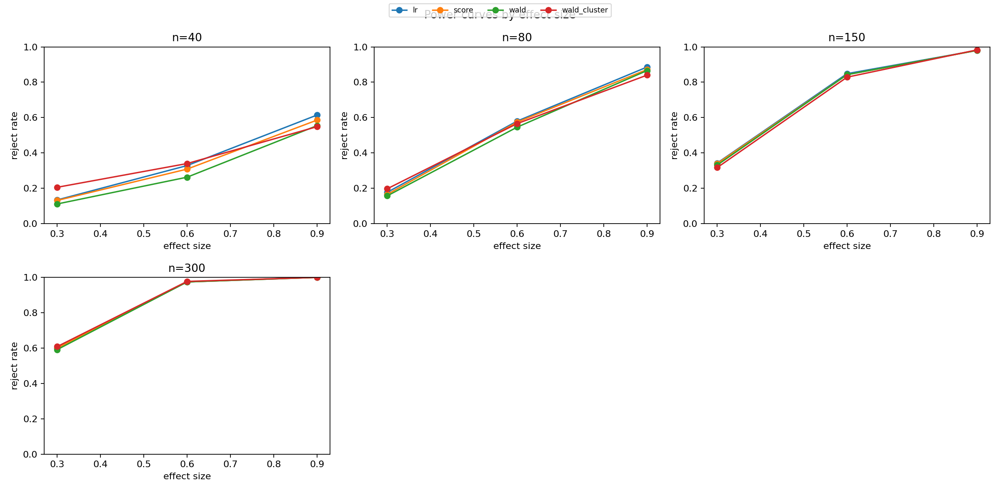
- 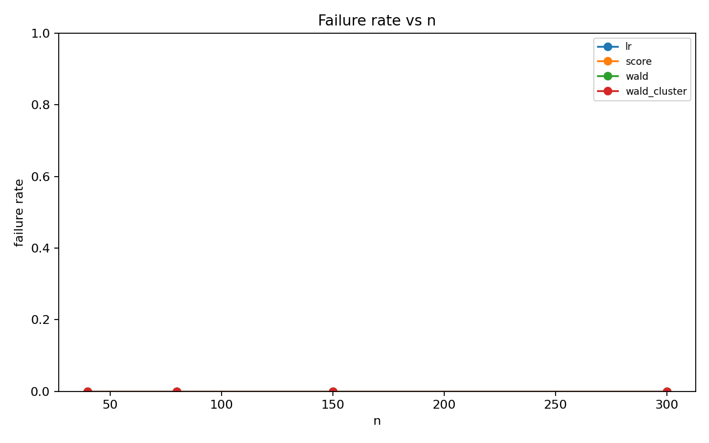
- 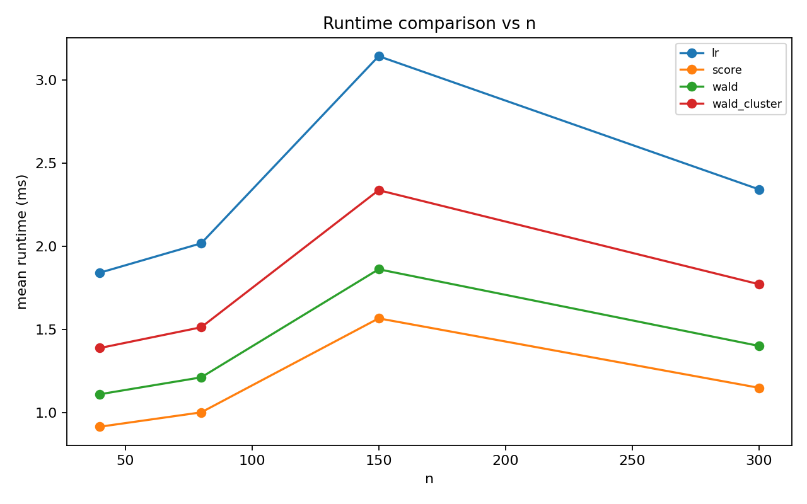

## Local alternatives: Logistic beta=c/sqrt(n)

- slug: `logistic_local_alternatives`
- notes: This scenario sets beta_1=c/sqrt(n), so power grows more slowly than fixed-effect alternatives. Finite-sample differences among Wald/Score/LR can remain visible before asymptotic agreement dominates.
- main: H0: beta_1 = 0 (df=1)

### Summary

| test_label | size | power_at_max_effect | failure_rate | mean_runtime_ms |
| --- | --- | --- | --- | --- |
| lr | 0.057 | 0.168 | 0.000 | 1.853 |
| score | 0.055 | 0.160 | 0.000 | 0.914 |
| wald | 0.048 | 0.147 | 0.000 | 1.113 |

### Inverted CI Summary

| test_label | ci_method | ci_valid_rate | ci_invalid_rate | coverage | left_miss_rate | right_miss_rate | asymmetry_right_minus_left | median_ci_width | mean_ci_width |
| --- | --- | --- | --- | --- | --- | --- | --- | --- | --- |
| lr | inverted_lr_chi2_quadratic | 1.000 | 0.000 | 0.948 | 0.025 | 0.027 | 0.002 | 0.762 | 0.847 |
| score | inverted_score_chi2_linearized | 1.000 | 0.000 | 0.953 | 0.025 | 0.022 | -0.003 | 0.753 | 0.834 |
| wald | inverted_wald_chi2 | 1.000 | 0.000 | 0.958 | 0.022 | 0.020 | -0.001 | 0.772 | 0.861 |

### CI Interpretation

想定: 局所対立では固定効果より情報増加が遅く、区間幅の収束が遅いです。有限標本では検定間の被覆差が残る可能性があります。

実測: 目標被覆率は 0.950 です。 被覆率乖離最大: `wald` が 0.958 (差 0.008)。 左右非対称最大: `score` で right-left=-0.003。 不適切行動(計算不能/無効CI)最大: `lr` の無効率 0.000。

### Interpretation

n の増加に伴い 3 検定が近づくか、どの条件で差が拡大するかを比較するシナリオです。

### Figures

- 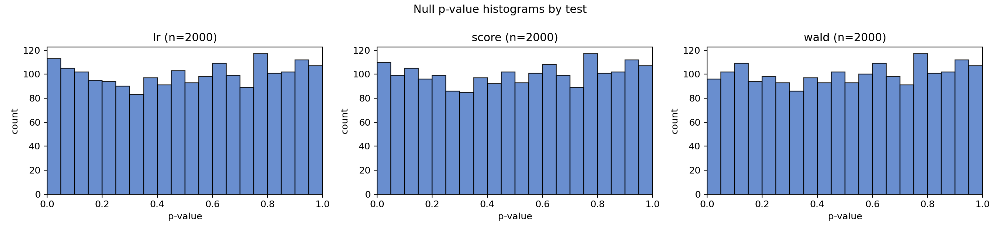
- 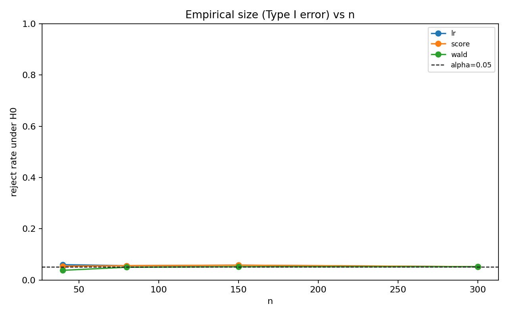
- 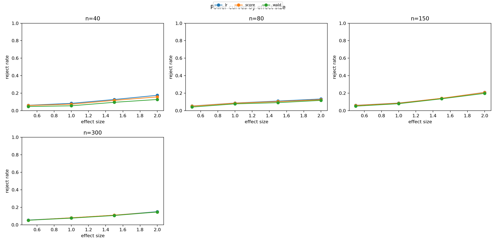
- 
- 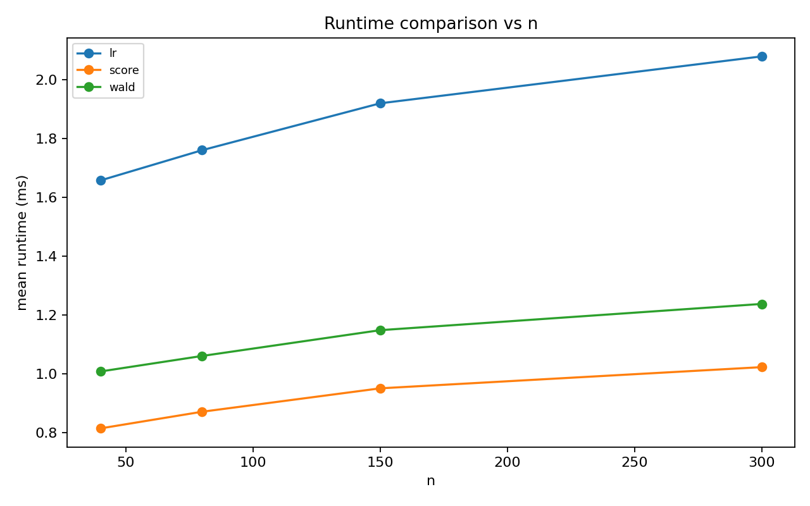
