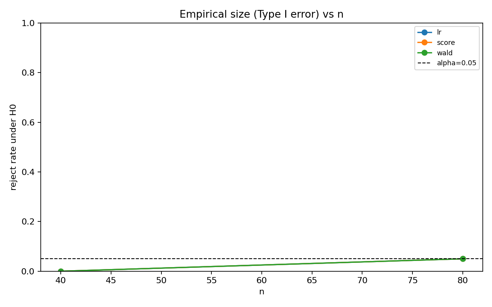
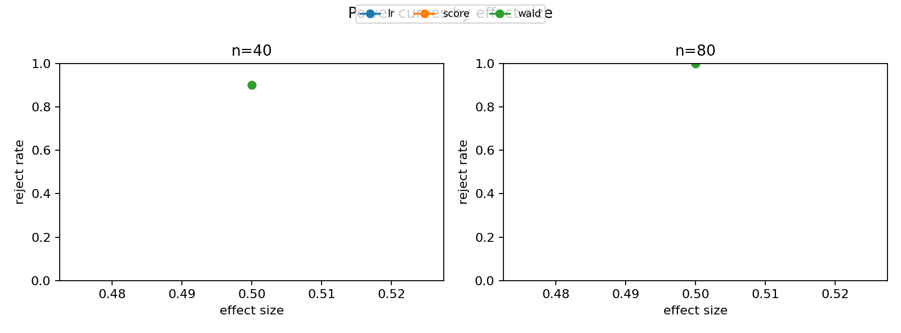
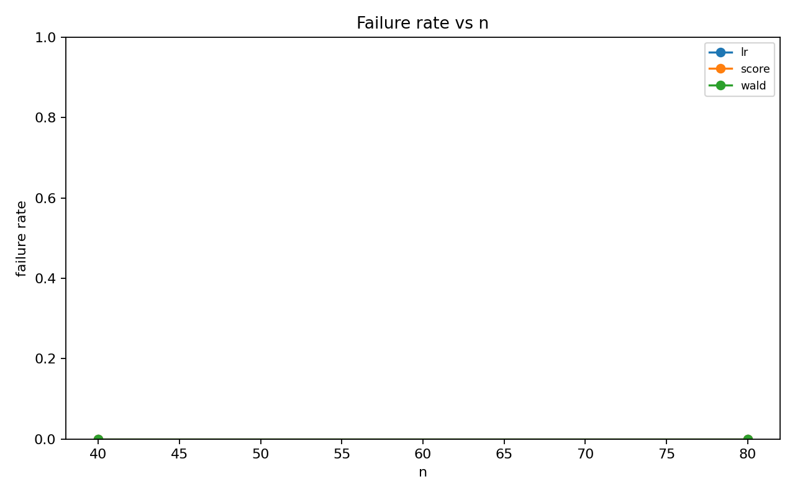
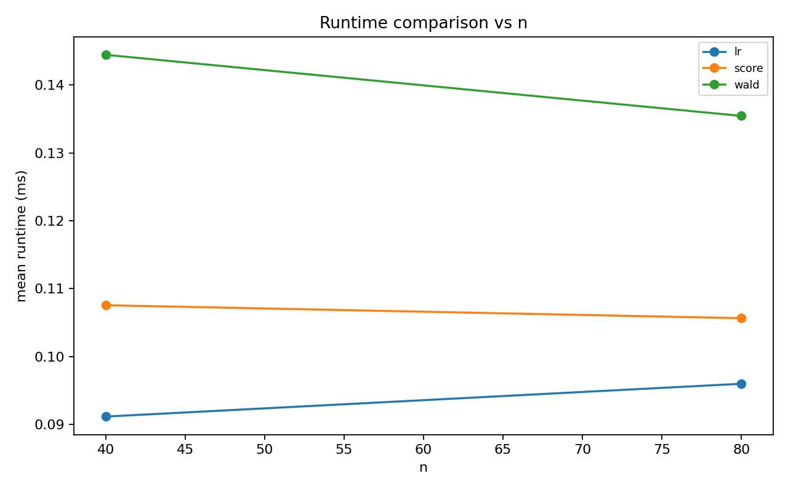
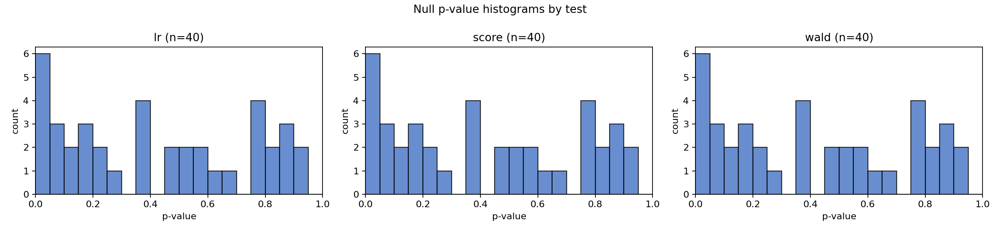
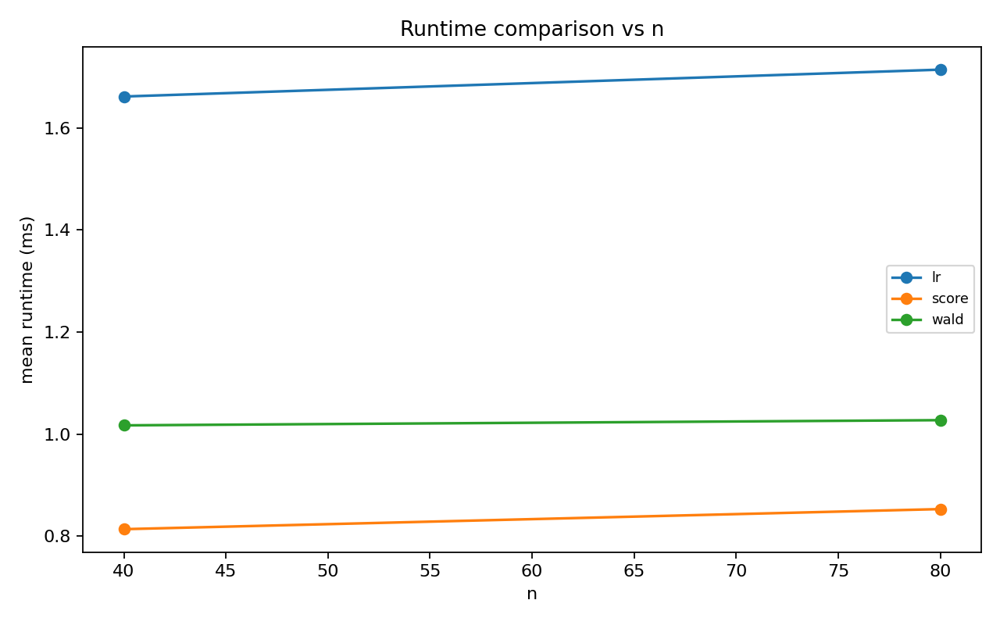
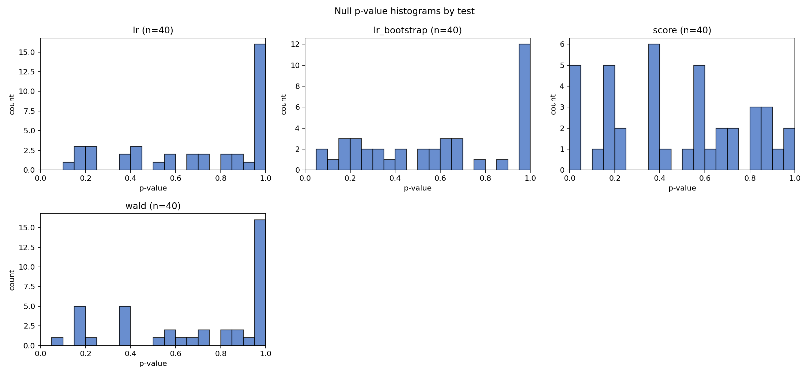
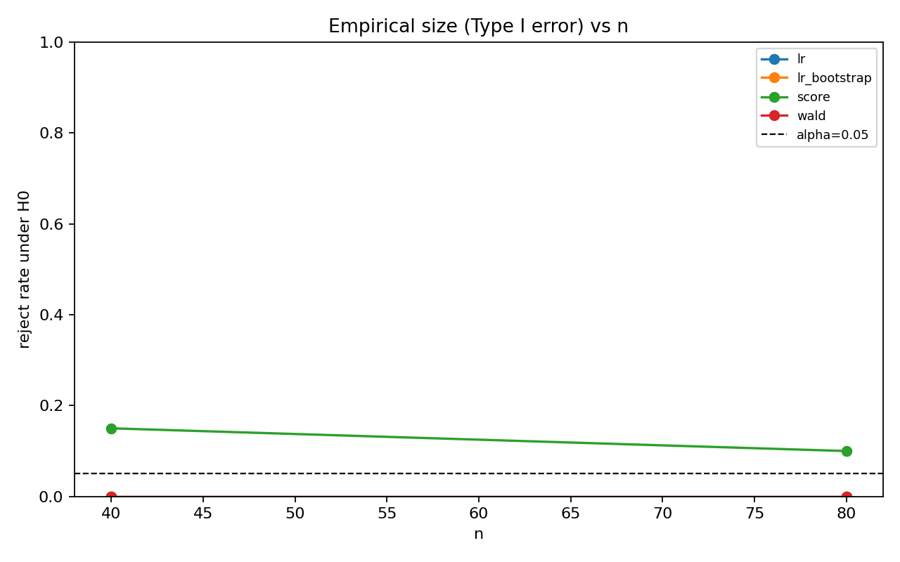
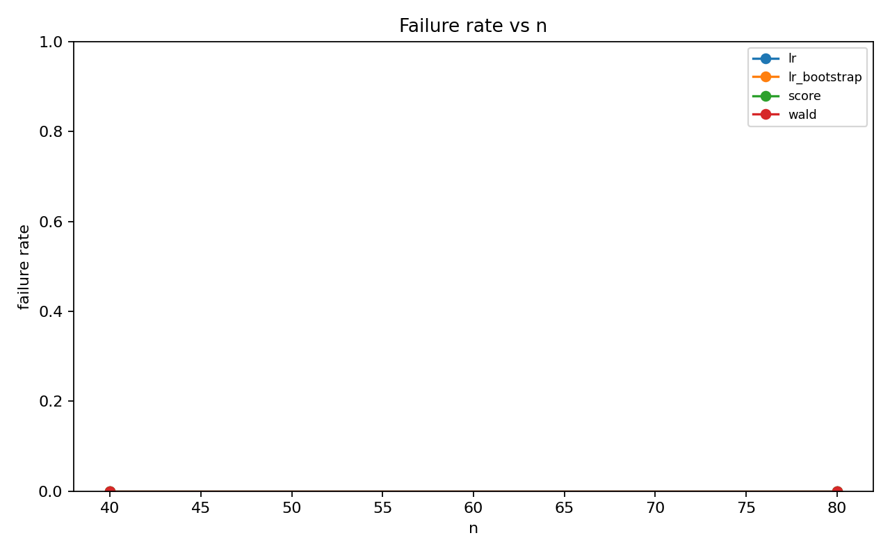
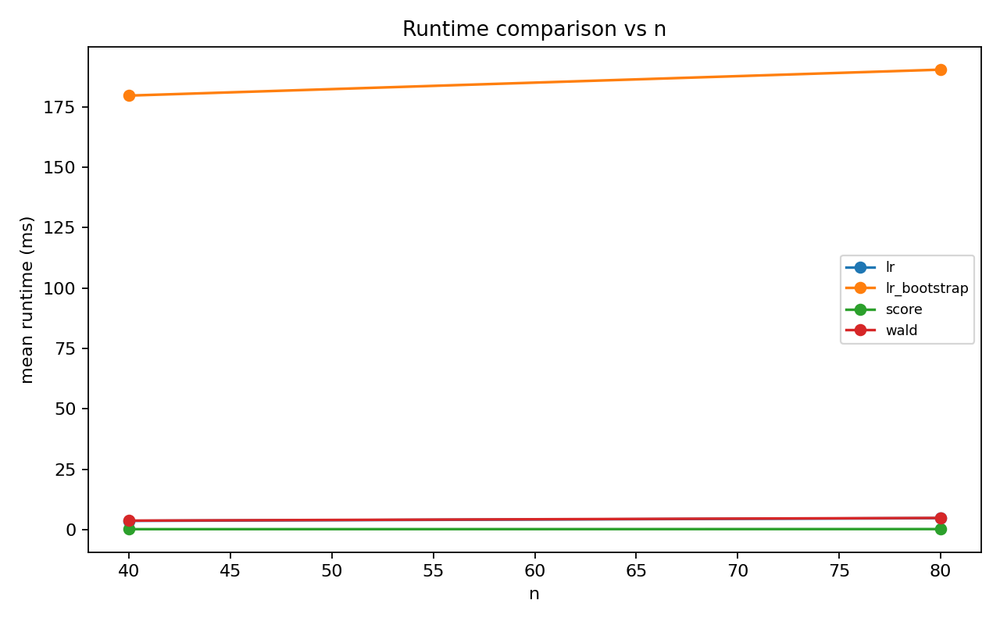

# Wald / Score / LR シミュレーション教材レポート

- alpha: 0.05
- total rows: 800

## Regular: Normal mean (sigma known)

- slug: `normal_mean_known_sigma`
- notes: 正則・解析的に扱える設定。nが増えるとWald/Score/LRはほぼ一致する。
- main: H0: mu = 0 (df=1)

### Summary

| test_label | size | power_at_max_effect | failure_rate | mean_runtime_ms |
| --- | --- | --- | --- | --- |
| lr | 0.025 | 0.950 | 0.000 | 0.094 |
| score | 0.025 | 0.950 | 0.000 | 0.107 |
| wald | 0.025 | 0.950 | 0.000 | 0.140 |

### Interpretation

n増加で3検定が近づくか、または設定由来の不安定性がどの検定に出るかを確認できます。

### Figures

- 
- 
- 
- 
- 

## Separation: Logistic (full MLE unstable)

- slug: `logistic_separation`
- notes: 完全/準分離でfull MLEが壊れるとWald/LRは失敗しやすい。帰無モデル依存のScoreは残りやすい。
- main: H0: beta_1 = 0 (df=1)

### Summary

| test_label | size | power_at_max_effect | failure_rate | mean_runtime_ms |
| --- | --- | --- | --- | --- |
| lr | 0.150 | 0.975 | 0.000 | 1.688 |
| score | 0.150 | 0.975 | 0.000 | 0.833 |
| wald | 0.150 | 0.975 | 0.000 | 1.022 |

### Interpretation

分離設定では失敗率の高い検定が目立ち、特に `lr` が不安定です。 一方で `lr` は比較的計算が成立しやすく、帰無点ベース検定の利点が出ます。

### Figures

- 
- 
- 
- 
- 

## Non-regular: ZIP boundary H0: pi=0

- slug: `zip_boundary`
- notes: 境界仮説でχ²近似が壊れ、Wald/Score/LRすべてサイズが歪み得る。LRのparametric bootstrapで校正可能。
- main: H0: pi = 0 (boundary) (df=1)

### Summary

| test_label | size | power_at_max_effect | failure_rate | mean_runtime_ms |
| --- | --- | --- | --- | --- |
| lr | 0.000 | 0.750 | 0.000 | 4.171 |
| lr_bootstrap | 0.000 | 0.850 | 0.000 | 185.077 |
| score | 0.125 | 0.750 | 0.000 | 0.185 |
| wald | 0.000 | 0.825 | 0.000 | 4.266 |

### Interpretation

境界仮説では通常のχ²近似が当てはまりにくく、サイズがalphaからずれます。 `lr_bootstrap` のサイズが他よりalphaに近ければ、校正の有効性が確認できます。

### Figures

- 
- 
- 
- 
- 
