# Wald / Score / LR シミュレーション教材レポート

- alpha: 0.05
- total rows: 2037

## Regular: Normal mean (sigma known)

- slug: `normal_mean_known_sigma`
- notes: 正則・解析的に扱える設定。nが増えるとWald/Score/LRはほぼ一致する。
- main: H0: mu = 0 (df=1)

### Summary

| test_label | size | power_at_max_effect | failure_rate | mean_runtime_ms |
| --- | --- | --- | --- | --- |
| lr | 0.000 | 0.917 | 0.000 | 0.048 |
| score | 0.000 | 0.917 | 0.000 | 0.081 |
| wald | 0.000 | 0.917 | 0.000 | 0.130 |

### Interpretation

n増加で3検定が近づくか、または設定由来の不安定性がどの検定に出るかを確認できます。

### Figures

- 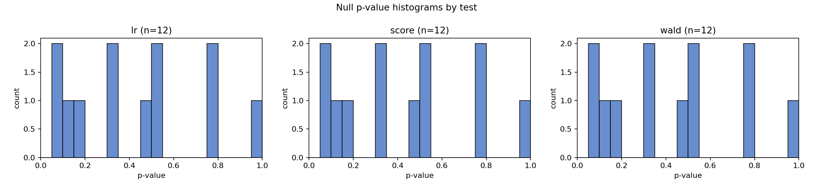
- 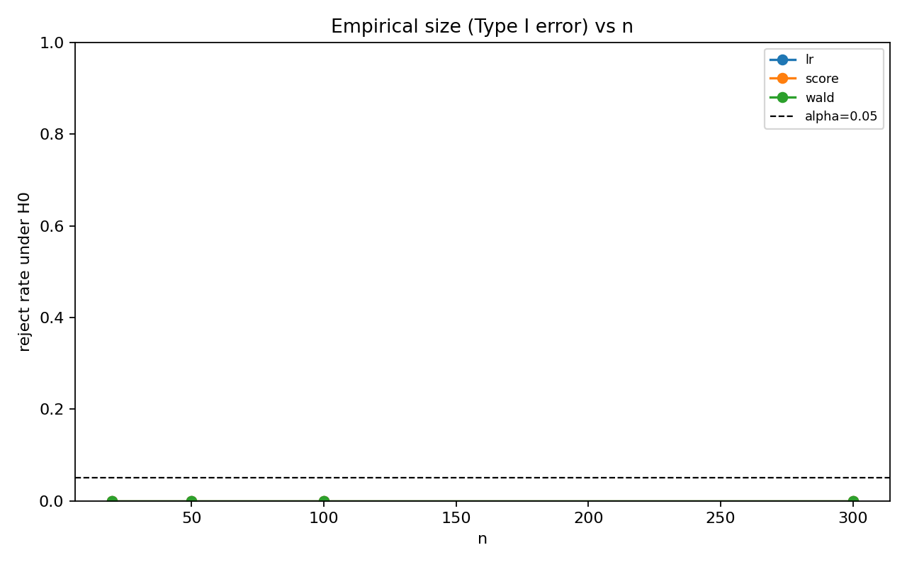
- 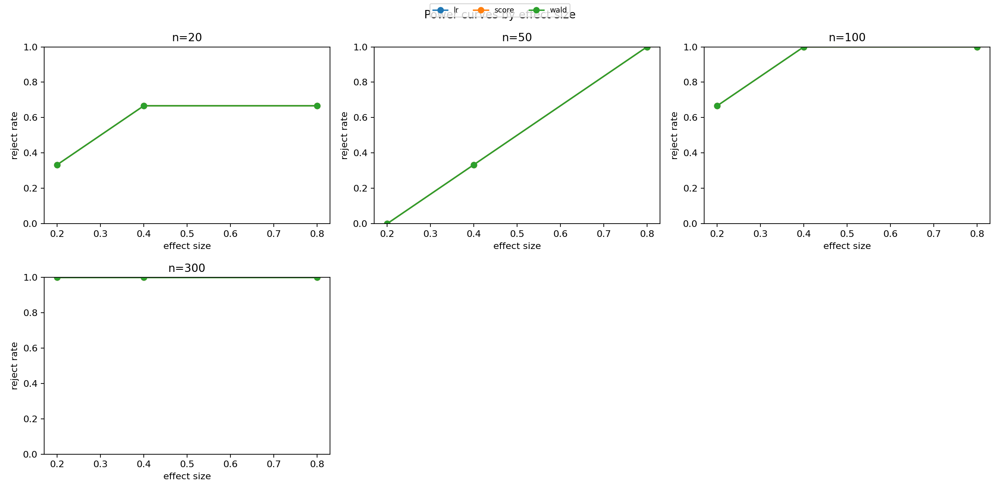
- 
- 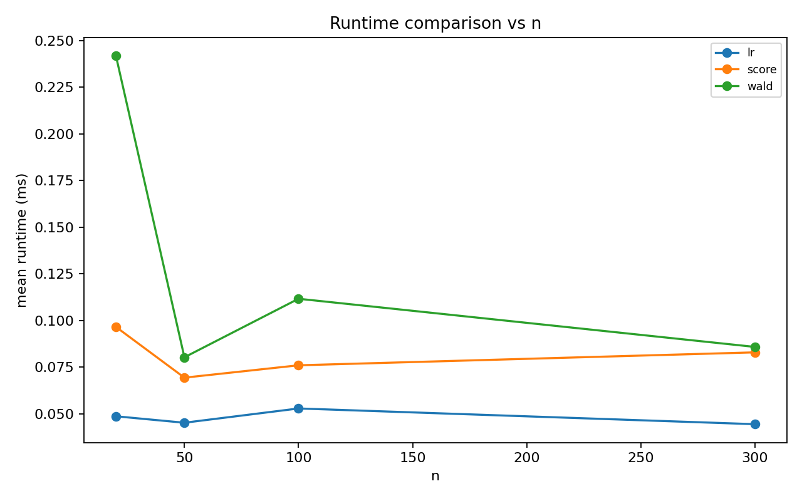

## Regular: Linear regression (single constraint)

- slug: `linear_regression_single_constraint`
- notes: 正則条件下の基礎例。単一・複数制約ともにn増加で3検定が漸近的一致を示す。
- main: H0: beta_1 = 0 (df=1)

### Summary

| test_label | size | power_at_max_effect | failure_rate | mean_runtime_ms |
| --- | --- | --- | --- | --- |
| lr | 0.083 | 1.000 | 0.000 | 0.052 |
| score | 0.083 | 1.000 | 0.000 | 0.090 |
| wald | 0.083 | 1.000 | 0.000 | 0.111 |

### Interpretation

n増加で3検定が近づくか、または設定由来の不安定性がどの検定に出るかを確認できます。

### Figures

- 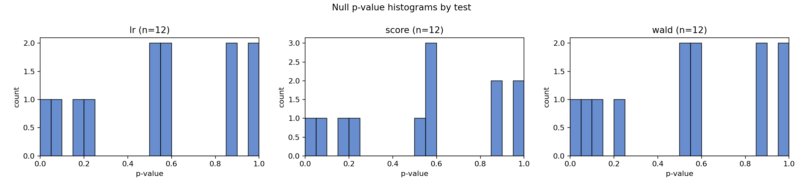
- 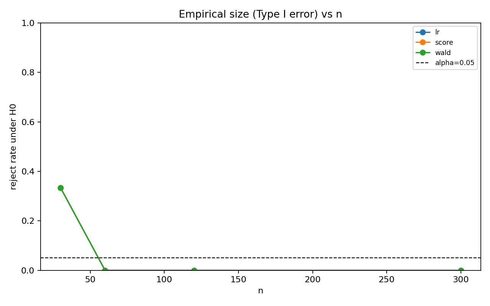
- 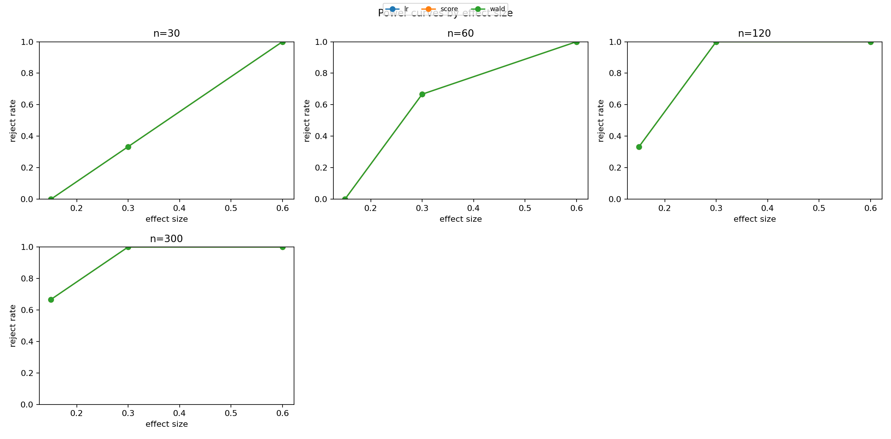
- 
- 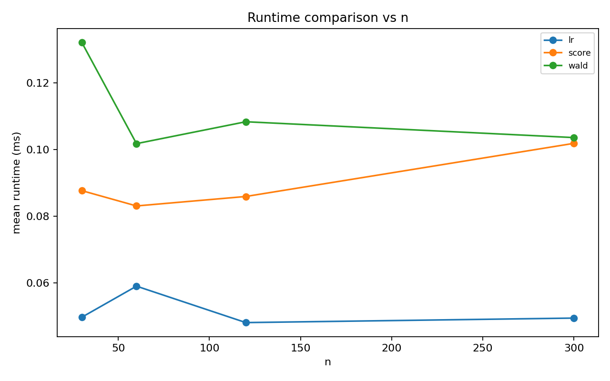

## Regular: Linear regression (multiple constraints)

- slug: `linear_regression_multiple_constraints`
- notes: 正則条件下の基礎例。単一・複数制約ともにn増加で3検定が漸近的一致を示す。
- main: H0: beta_1, beta_2 = 0 (df=2)

### Summary

| test_label | size | power_at_max_effect | failure_rate | mean_runtime_ms |
| --- | --- | --- | --- | --- |
| lr | 0.000 | 1.000 | 0.000 | 0.049 |
| score | 0.000 | 1.000 | 0.000 | 0.083 |
| wald | 0.000 | 1.000 | 0.000 | 0.100 |

### Interpretation

n増加で3検定が近づくか、または設定由来の不安定性がどの検定に出るかを確認できます。

### Figures

- 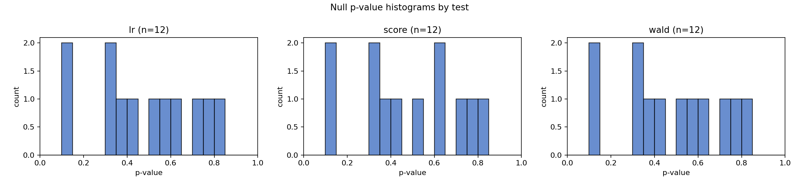
- 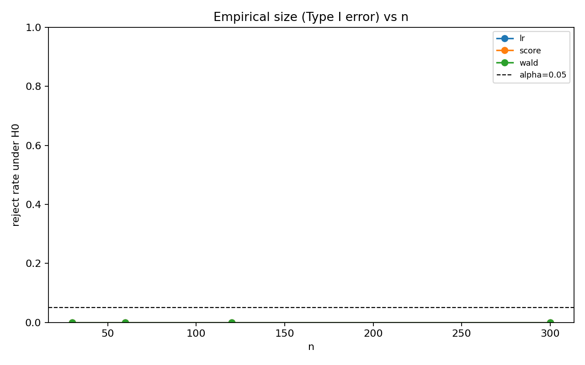
- 
- 
- 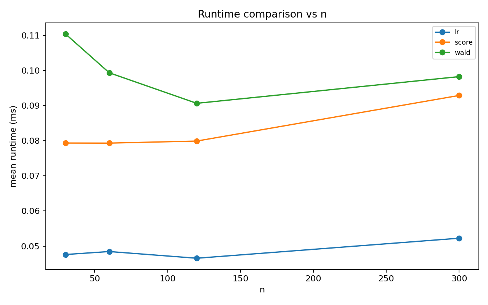

## Separation: Logistic (full MLE unstable)

- slug: `logistic_separation`
- notes: 完全/準分離でfull MLEが壊れるとWald/LRは失敗しやすい。帰無モデル依存のScoreは残りやすい。
- main: H0: beta_1 = 0 (df=1)

### Summary

| test_label | size | power_at_max_effect | failure_rate | mean_runtime_ms |
| --- | --- | --- | --- | --- |
| lr | 0.000 | 1.000 | 0.000 | 0.058 |
| score | 0.000 | 1.000 | 0.000 | 0.088 |
| wald | 0.000 | 0.000 | 0.000 | 0.130 |

### Interpretation

分離設定では失敗率の高い検定が目立ち、特に `lr` が不安定です。 一方で `lr` は比較的計算が成立しやすく、帰無点ベース検定の利点が出ます。

### Figures

- 
- 
- 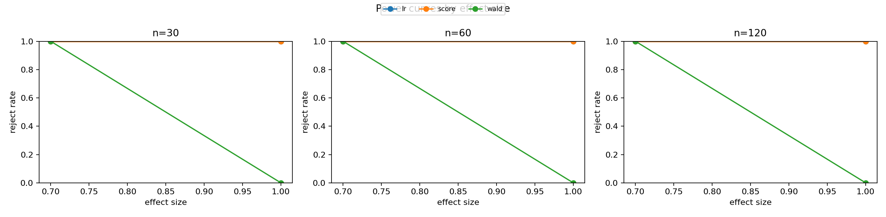
- 
- 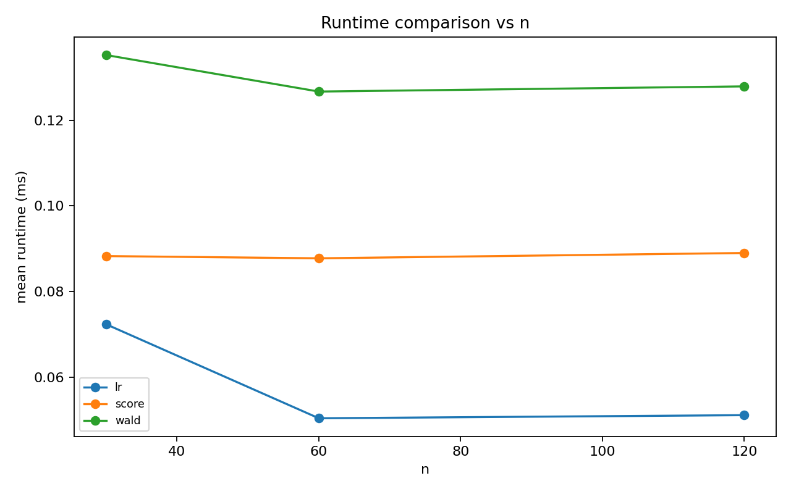

## Finite-sample: Logistic small n

- slug: `logistic_small_sample`
- notes: 小標本では漸近近似誤差でサイズ/パワーに差が出る。n増加で差は縮まる。
- main: H0: beta_1 = 0 (df=1)

### Summary

| test_label | size | power_at_max_effect | failure_rate | mean_runtime_ms |
| --- | --- | --- | --- | --- |
| lr | 0.000 | 0.750 | 0.000 | 0.052 |
| score | 0.000 | 0.667 | 0.000 | 0.089 |
| wald | 0.000 | 0.667 | 0.000 | 0.126 |

### Interpretation

n増加で3検定が近づくか、または設定由来の不安定性がどの検定に出るかを確認できます。

### Figures

- 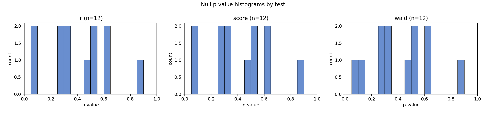
- 
- 
- 
- 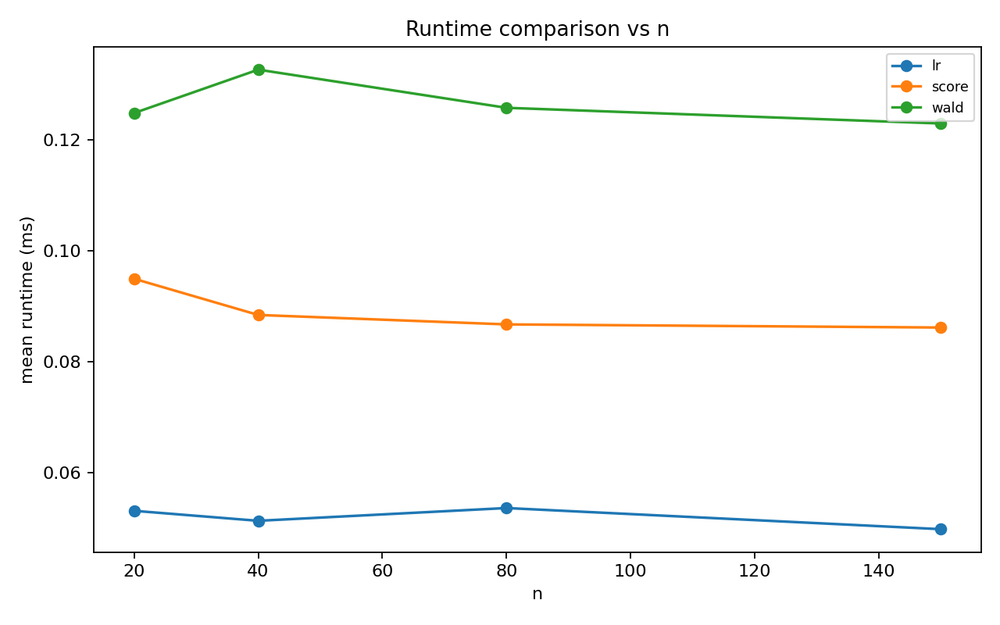

## Practical: Wald batch speed for many hypotheses

- slug: `wald_runtime_batch`
- notes: 多数係数を順次検定する実務想定。1回のfull推定を再利用できるWaldはLR/Scoreより高速になりやすい。
- beta_1: H0: beta_1 = 0 (df=1)
- beta_2: H0: beta_2 = 0 (df=1)
- beta_3: H0: beta_3 = 0 (df=1)
- beta_4: H0: beta_4 = 0 (df=1)
- beta_5: H0: beta_5 = 0 (df=1)
- beta_6: H0: beta_6 = 0 (df=1)
- beta_7: H0: beta_7 = 0 (df=1)
- beta_8: H0: beta_8 = 0 (df=1)
- beta_9: H0: beta_9 = 0 (df=1)
- beta_10: H0: beta_10 = 0 (df=1)

### Summary

| test_label | size | power_at_max_effect | failure_rate | mean_runtime_ms |
| --- | --- | --- | --- | --- |
| lr | 0.100 | 0.500 | 0.000 | 0.052 |
| score | 0.100 | 0.500 | 0.000 | 0.111 |
| wald | 0.100 | 0.500 | 0.000 | 0.108 |

### Interpretation

多数仮説の同時処理では、Waldがfull推定再利用できるため平均runtimeで有利になりやすい設定です。

### Figures

- 
- 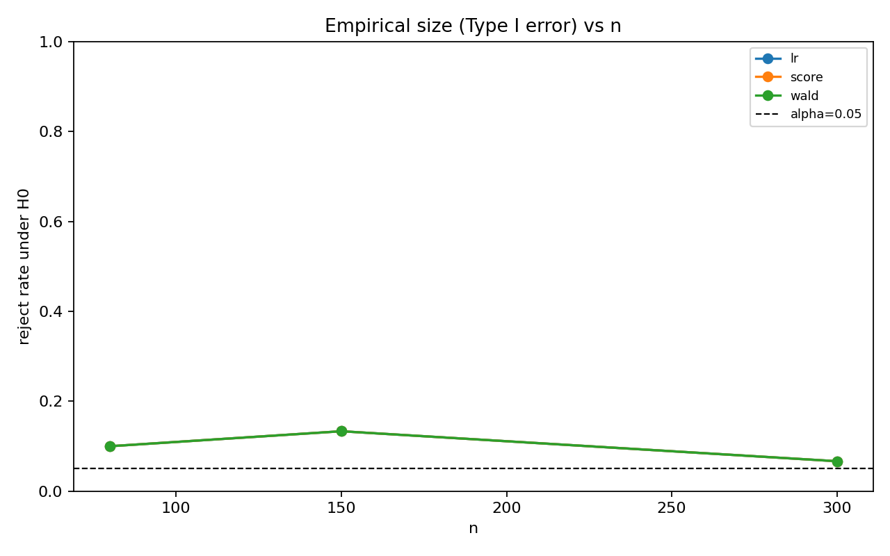
- 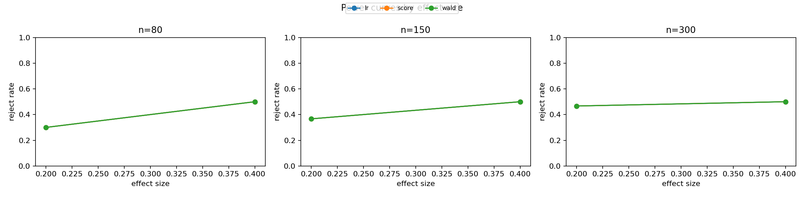
- 
- 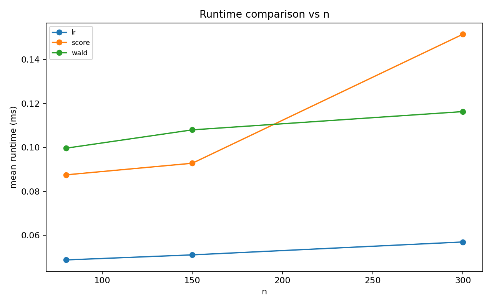

## Non-regular: ZIP boundary H0: pi=0

- slug: `zip_boundary`
- notes: 境界仮説でχ²近似が壊れ、Wald/Score/LRすべてサイズが歪み得る。LRのparametric bootstrapで校正可能。
- main: H0: pi = 0 (boundary) (df=1)

### Summary

| test_label | size | power_at_max_effect | failure_rate | mean_runtime_ms |
| --- | --- | --- | --- | --- |
| lr | 0.000 | 0.500 | 0.000 | 0.057 |
| lr_bootstrap | 0.000 | 0.500 | 0.000 | 129.749 |
| score | 0.167 | 0.500 | 0.000 | 0.111 |
| wald | 0.000 | 0.500 | 0.000 | 0.168 |

### Interpretation

境界仮説では通常のχ²近似が当てはまりにくく、サイズがalphaからずれます。 `lr_bootstrap` のサイズが他よりalphaに近ければ、校正の有効性が確認できます。

### Figures

- 
- 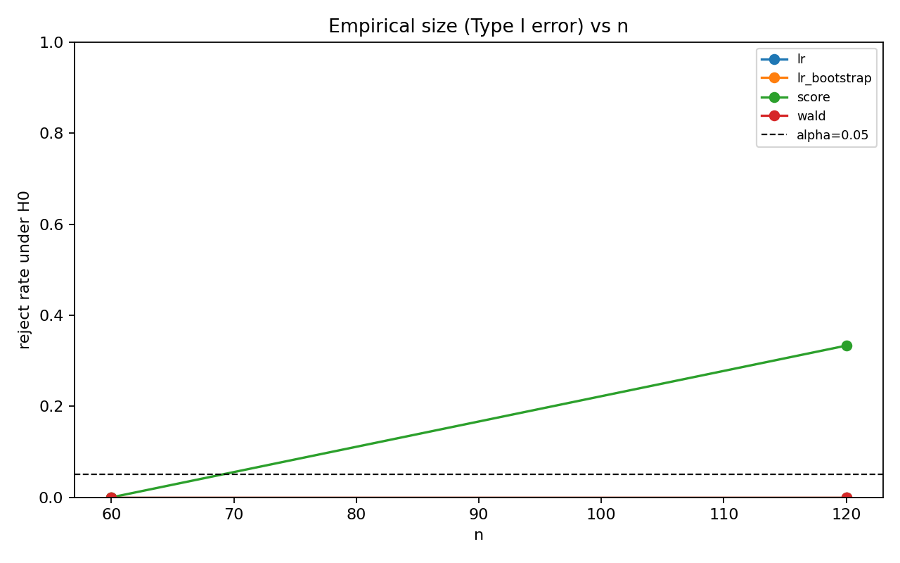
- 
- 
- 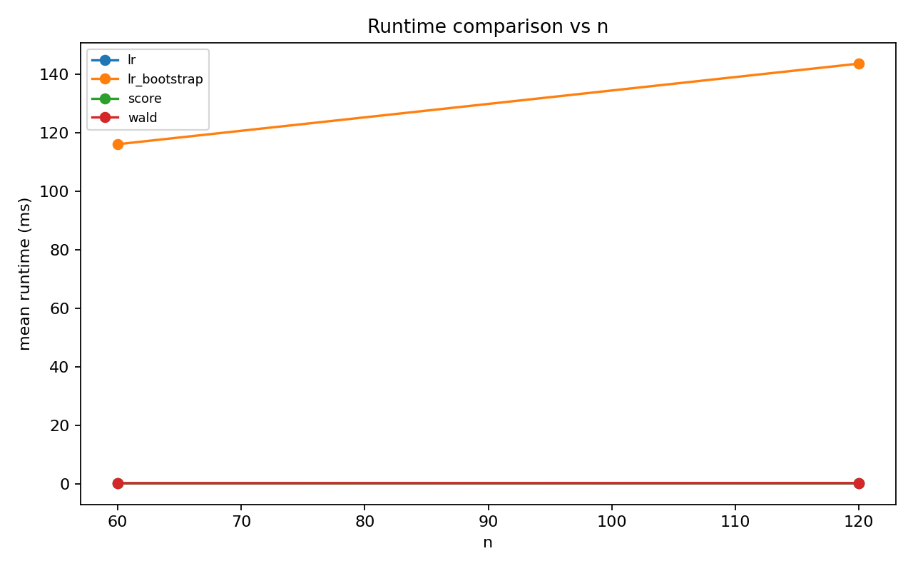

## Weak identification: severe collinearity

- slug: `collinearity`
- notes: 強共線性で情報行列がほぼ特異となり、分散推定不安定や失敗率上昇が起こる。
- main: H0: beta_1 = 0 (df=1)

### Summary

| test_label | size | power_at_max_effect | failure_rate | mean_runtime_ms |
| --- | --- | --- | --- | --- |
| lr | 0.000 | 0.000 | 0.000 | 0.058 |
| score | 0.000 | 0.000 | 0.000 | 0.103 |
| wald | 0.000 | 0.000 | 0.000 | 0.125 |

### Interpretation

共線性で情報行列が不安定になり、失敗率上昇や推定分散の増大が確認できます。

### Figures

- 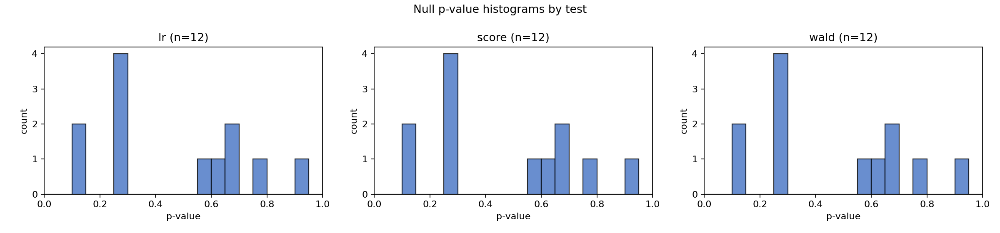
- 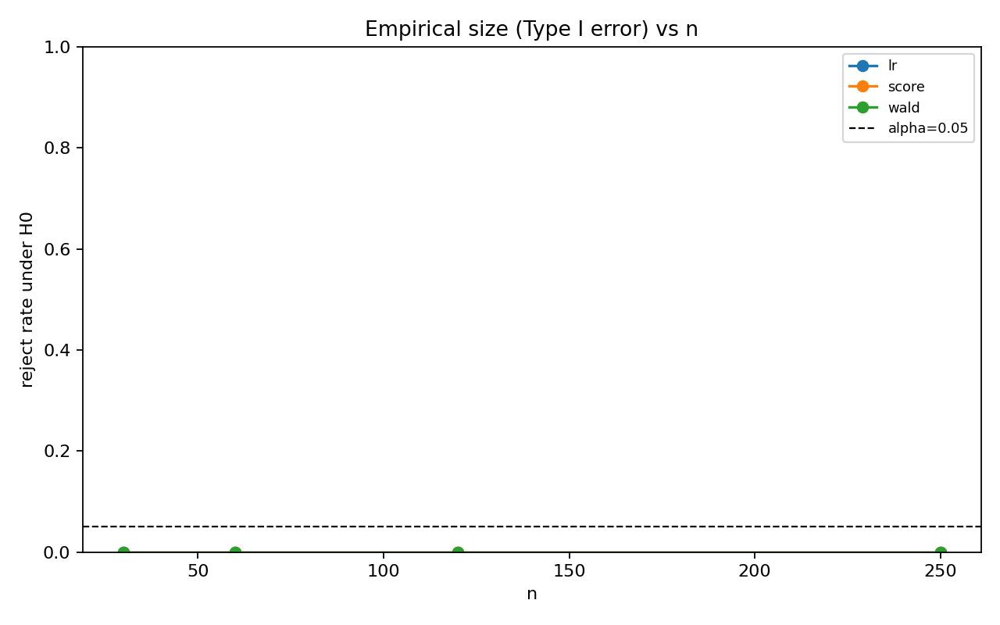
- 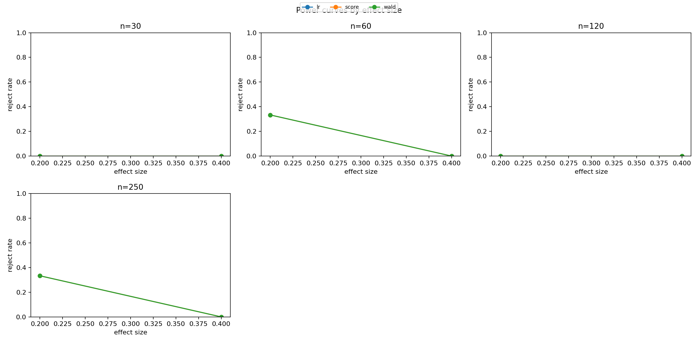
- 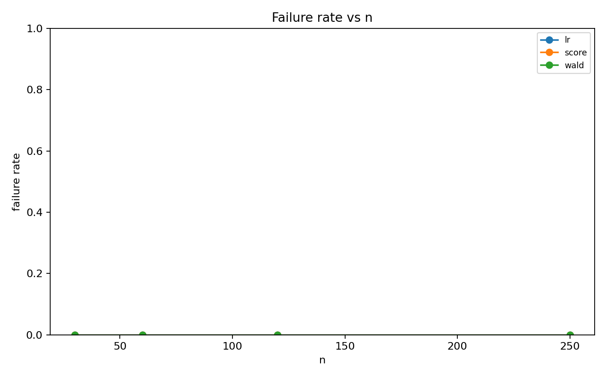
- 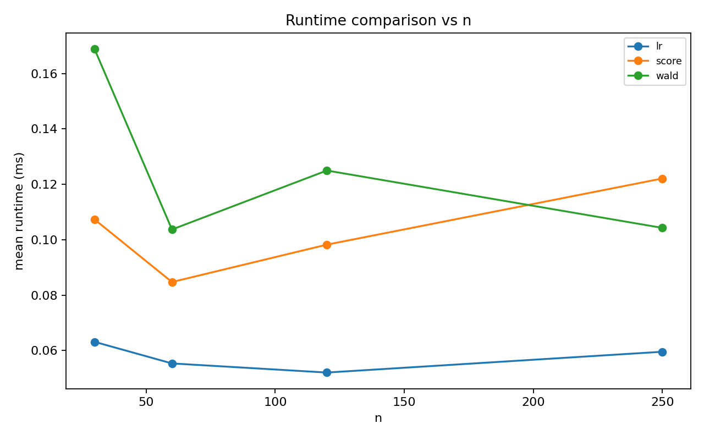

## Misspecification: True NegBin, fitted Poisson

- slug: `poisson_misspec`
- notes: 真の分布が過分散なのにPoisson仮定で推定。3検定が同時にサイズ崩壊する例。
- main: H0: beta_1 = 0 (df=1)

### Summary

| test_label | size | power_at_max_effect | failure_rate | mean_runtime_ms |
| --- | --- | --- | --- | --- |
| lr | 0.333 | 1.000 | 0.000 | 0.054 |
| score | 0.333 | 1.000 | 0.000 | 0.108 |
| wald | 0.333 | 1.000 | 0.000 | 0.144 |

### Interpretation

モデルミススペック下ではサイズがalpha=0.05から体系的に外れ、3検定が同時に崩れることがあります。

### Figures

- 
- 
- 
- 
- 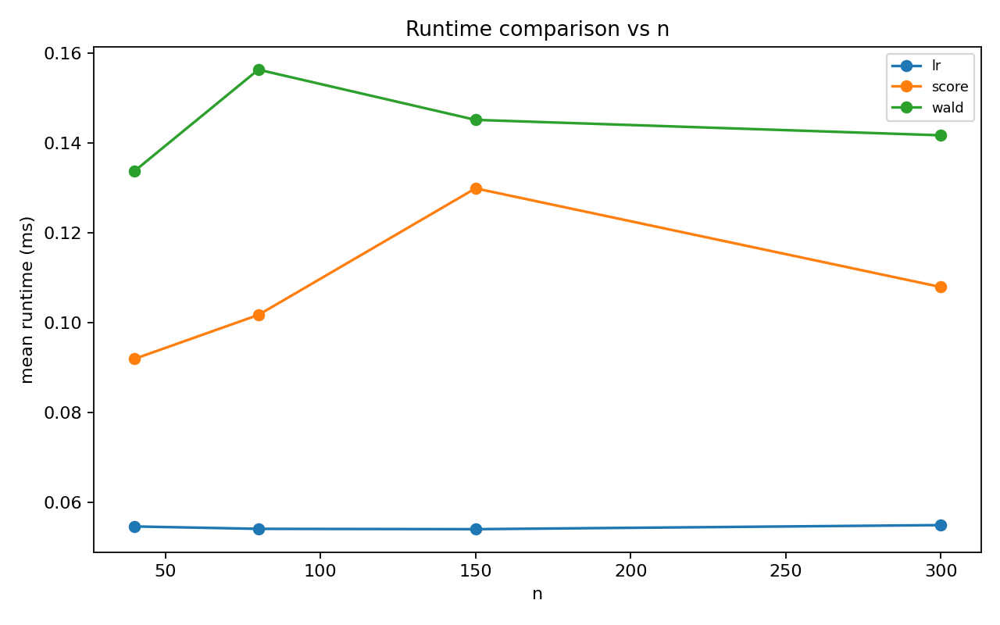

## Invariance demo: beta=0 vs OR=1

- slug: `invariance_demo`
- notes: 同値仮説でもWaldはパラメータ化依存でズレ得る。LRは同じfull/null比較なので相対的に不変。
- beta: H0: beta_1 = 0 (df=1)
- or: H0: OR = 1 (df=1)

### Summary

| test_label | size | power_at_max_effect | failure_rate | mean_runtime_ms |
| --- | --- | --- | --- | --- |
| lr:beta | 0.000 | 0.583 | 0.000 | 0.051 |
| score:beta | 0.000 | 0.583 | 0.000 | 0.086 |
| wald:beta | 0.000 | 0.583 | 0.000 | 0.124 |
| wald:or | 0.000 | 0.333 | 0.000 | 0.122 |

### Interpretation

同値仮説 `beta=0` と `OR=1` でWaldの値がずれ得る一方、LRは同じfull/null比較のため相対的に不変です。

### Figures

- 
- 
- 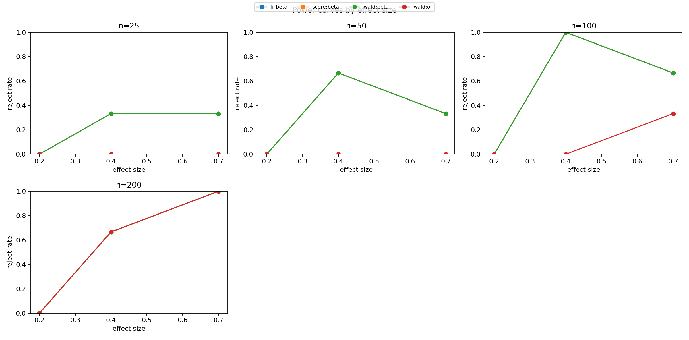
- 
- 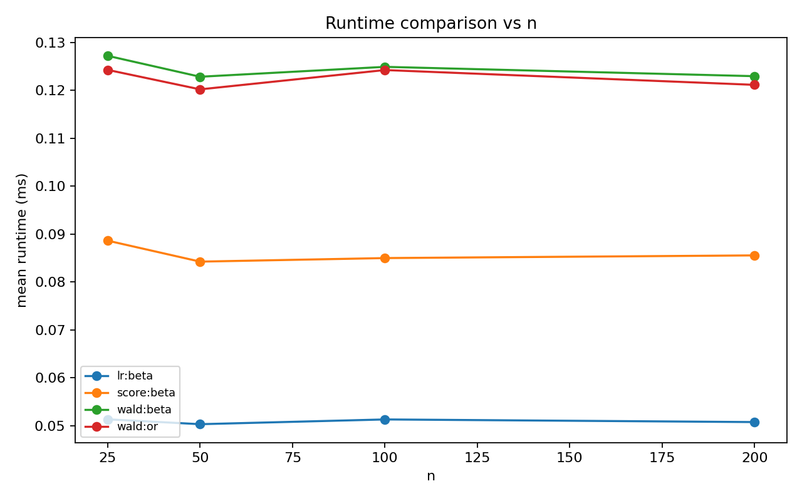

## Overfitting/p-hacking: stepwise then test

- slug: `phacking_stepwise`
- notes: 変数選択後に同データで検定すると偽陽性率が増える。探索/検定分離でサイズが回復する。
- same_data: H0: selected beta = 0 (selection and testing on same data) (df=1)
- split_data: H0: selected beta = 0 (selection on train, testing on test split) (df=1)

### Summary

| test_label | size | power_at_max_effect | failure_rate | mean_runtime_ms |
| --- | --- | --- | --- | --- |
| lr:same_data | 0.778 | 0.778 | 0.000 | 0.048 |
| lr:split_data | 0.000 | 0.000 | 0.000 | 0.047 |
| score:same_data | 0.778 | 0.778 | 0.000 | 0.083 |
| score:split_data | 0.000 | 0.000 | 0.000 | 0.076 |
| wald:same_data | 0.778 | 0.778 | 0.000 | 0.117 |
| wald:split_data | 0.000 | 0.000 | 0.000 | 0.102 |

### Interpretation

同一データ選択の系列（`*:same_data`）は、split系列（`*:split_data`）よりサイズが大きくなりやすく、選択バイアスによる偽陽性増加が見えます。

### Figures

- 
- 
- 
- 
- 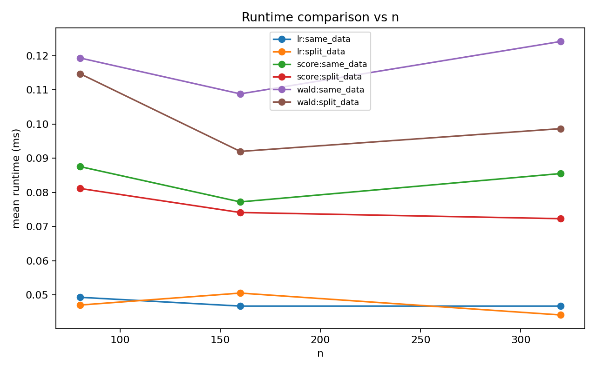
