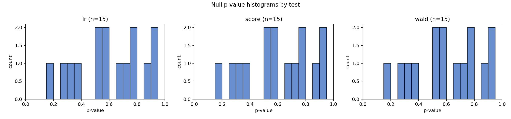
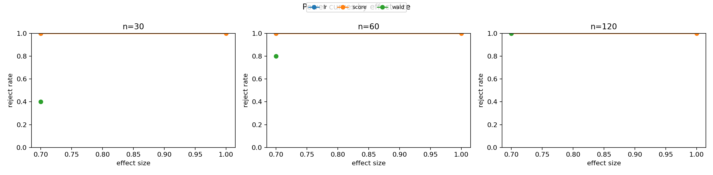
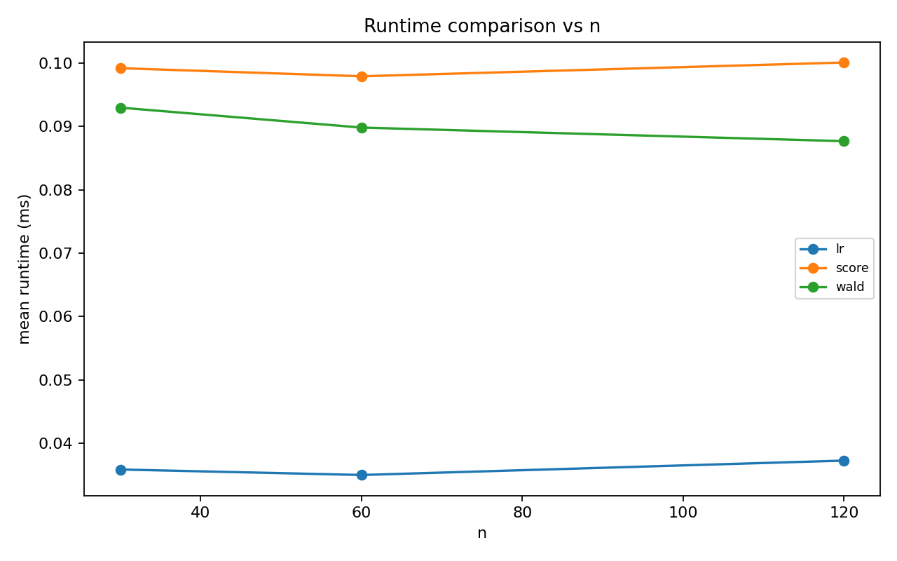
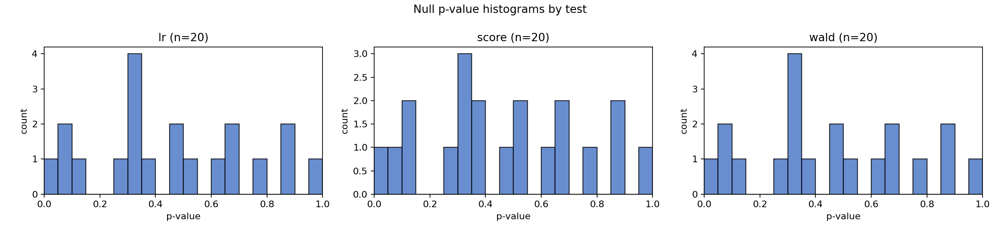
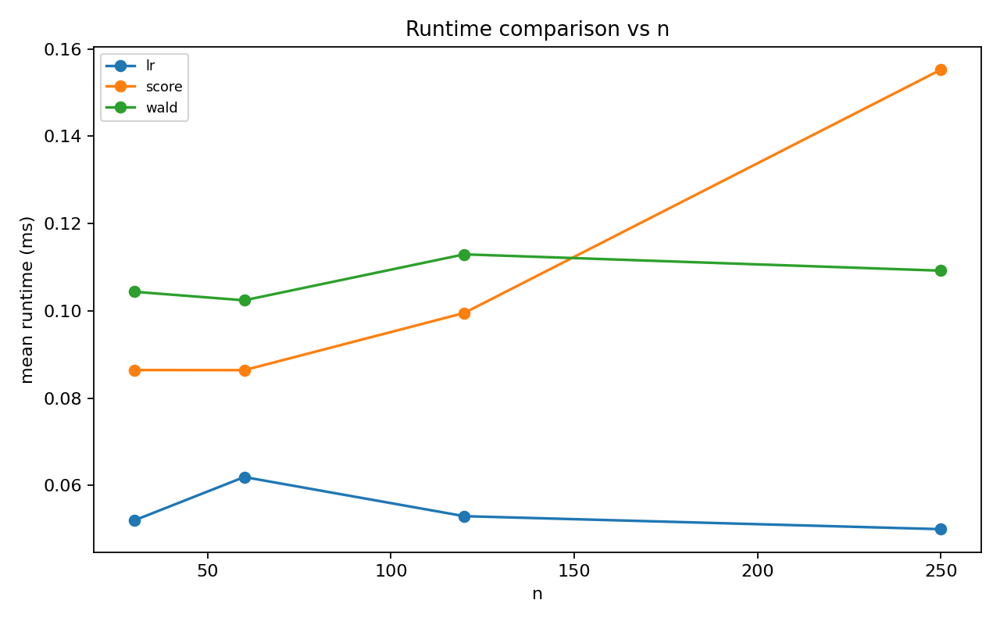

# Wald / Score / LR シミュレーション教材レポート

- alpha: 0.05
- total rows: 315

## Separation: Logistic (full MLE unstable)

- slug: `logistic_separation`
- notes: 完全/準分離でfull MLEが壊れるとWald/LRは失敗しやすい。帰無モデル依存のScoreは残りやすい。
- main: H0: beta_1 = 0 (df=1)

### Summary

| test_label | size | power_at_max_effect | failure_rate | mean_runtime_ms |
| --- | --- | --- | --- | --- |
| lr | 0.000 | NA | 0.333 | 0.036 |
| score | 0.000 | 1.000 | 0.000 | 0.099 |
| wald | 0.000 | NA | 0.333 | 0.090 |

### Interpretation

分離設定では失敗率の高い検定が目立ち、特に `lr` が不安定です。 一方で `score` は比較的計算が成立しやすく、帰無点ベース検定の利点が出ます。

### Figures

- 
- 
- 
- 
- 

## Weak identification: severe collinearity

- slug: `collinearity`
- notes: 強共線性で情報行列がほぼ特異となり、分散推定不安定や失敗率上昇が起こる。
- main: H0: beta_1 = 0 (df=1)

### Summary

| test_label | size | power_at_max_effect | failure_rate | mean_runtime_ms |
| --- | --- | --- | --- | --- |
| lr | 0.050 | 0.050 | 0.000 | 0.054 |
| score | 0.050 | 0.050 | 0.000 | 0.107 |
| wald | 0.050 | 0.050 | 0.000 | 0.107 |

### Interpretation

共線性で情報行列が不安定になり、失敗率上昇や推定分散の増大が確認できます。

### Figures

- 
- 
- 
- 
- 
