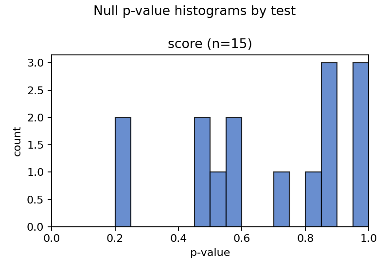
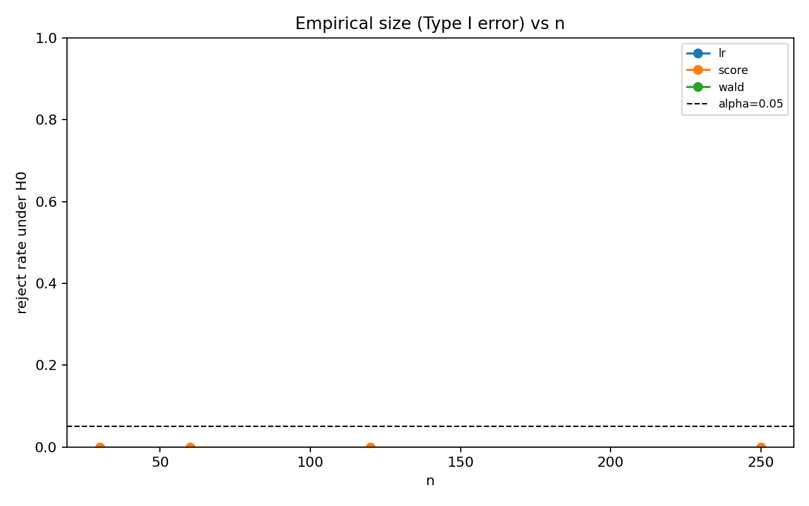
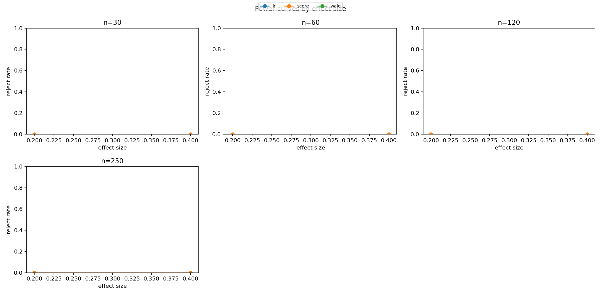
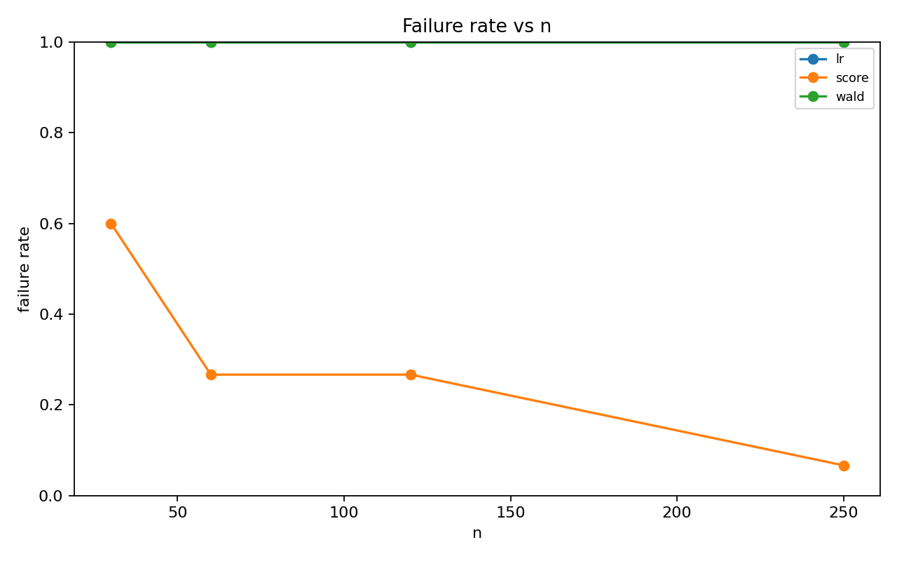
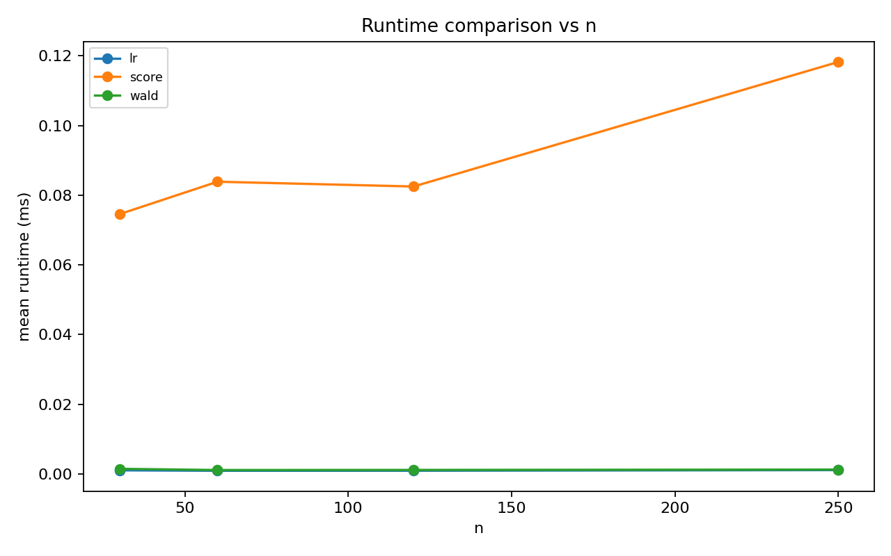

# Wald / Score / LR シミュレーション教材レポート

- alpha: 0.05
- total rows: 180

## Weak identification: severe collinearity

- slug: `collinearity`
- notes: 強共線性で情報行列がほぼ特異となり、分散推定不安定や失敗率上昇が起こる。
- main: H0: beta_1 = 0 (df=1)

### Summary

| test_label | size | power_at_max_effect | failure_rate | mean_runtime_ms |
| --- | --- | --- | --- | --- |
| lr | NA | NA | 1.000 | 0.001 |
| score | 0.000 | 0.000 | 0.300 | 0.090 |
| wald | NA | NA | 1.000 | 0.001 |

### Interpretation

共線性で情報行列が不安定になり、失敗率上昇や推定分散の増大が確認できます。

### Figures

- 
- 
- 
- 
- 
