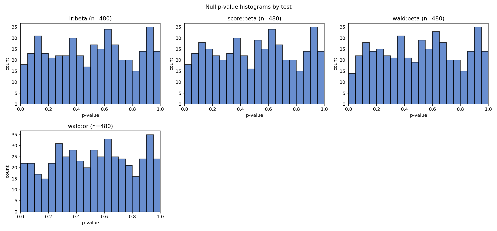
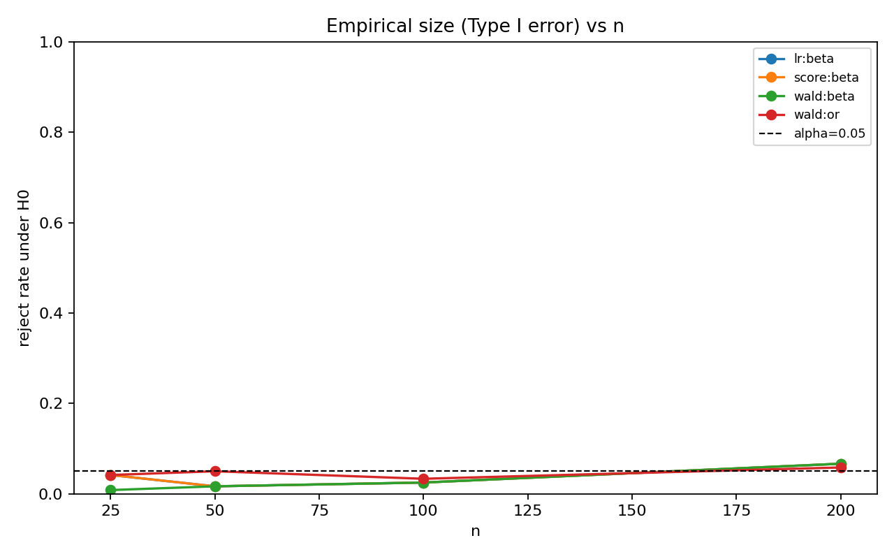
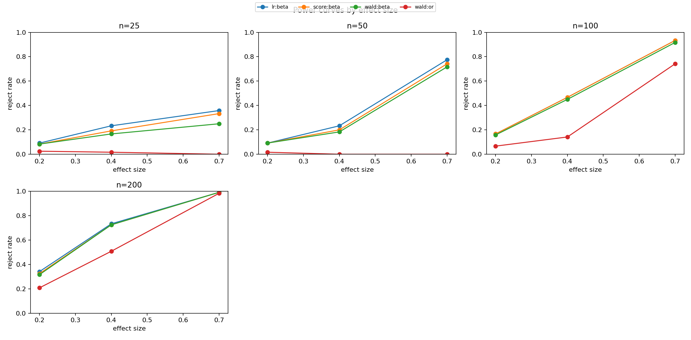
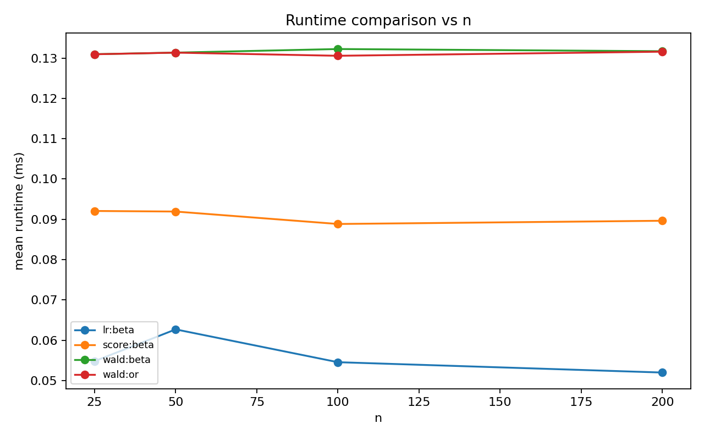

# Wald / Score / LR シミュレーション教材レポート

- alpha: 0.05
- total rows: 7680

## Invariance demo: beta=0 vs OR=1

- slug: `invariance_demo`
- notes: 同値仮説でもWaldはパラメータ化依存でズレ得る。LRは同じfull/null比較なので相対的に不変。
- beta: H0: beta_1 = 0 (df=1)
- or: H0: OR = 1 (df=1)

### Summary

| test_label | size | power_at_max_effect | failure_rate | mean_runtime_ms |
| --- | --- | --- | --- | --- |
| lr:beta | 0.037 | 0.765 | 0.000 | 0.056 |
| score:beta | 0.037 | 0.750 | 0.000 | 0.091 |
| wald:beta | 0.029 | 0.719 | 0.000 | 0.132 |
| wald:or | 0.046 | 0.431 | 0.000 | 0.131 |

### Interpretation

同値仮説 `beta=0` と `OR=1` でWaldの値がずれ得る一方、LRは同じfull/null比較のため相対的に不変です。

### Figures

- 
- 
- 
- 
- 
