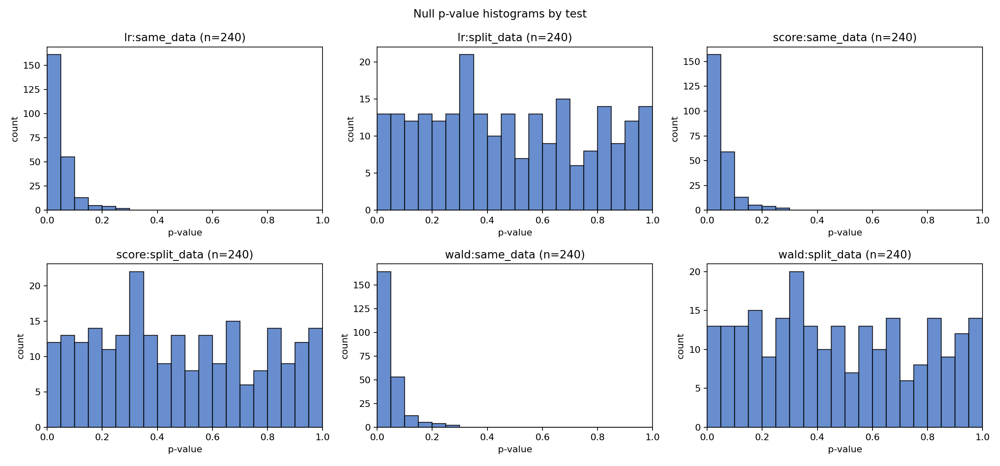
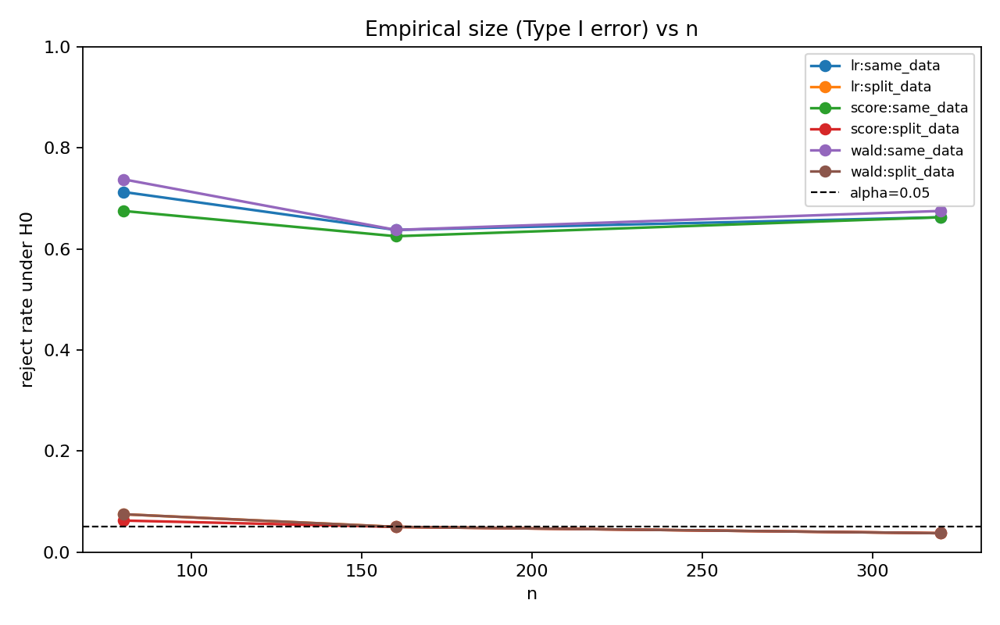
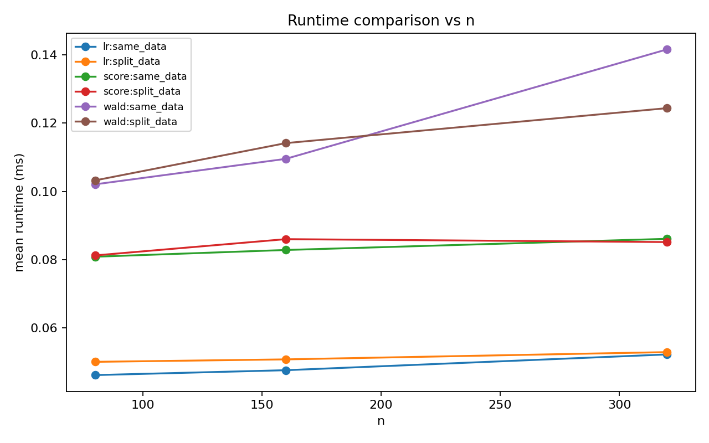

# Wald / Score / LR シミュレーション教材レポート

- alpha: 0.05
- total rows: 1440

## Overfitting/p-hacking: stepwise then test

- slug: `phacking_stepwise`
- notes: 変数選択後に同データで検定すると偽陽性率が増える。探索/検定分離でサイズが回復する。
- same_data: H0: selected beta = 0 (selection and testing on same data) (df=1)
- split_data: H0: selected beta = 0 (selection on train, testing on test split) (df=1)

### Summary

| test_label | size | power_at_max_effect | failure_rate | mean_runtime_ms |
| --- | --- | --- | --- | --- |
| lr:same_data | 0.671 | 0.671 | 0.000 | 0.049 |
| lr:split_data | 0.054 | 0.054 | 0.000 | 0.051 |
| score:same_data | 0.654 | 0.654 | 0.000 | 0.083 |
| score:split_data | 0.050 | 0.050 | 0.000 | 0.084 |
| wald:same_data | 0.683 | 0.683 | 0.000 | 0.118 |
| wald:split_data | 0.054 | 0.054 | 0.000 | 0.114 |

### Interpretation

同一データ選択の系列（`*:same_data`）は、split系列（`*:split_data`）よりサイズが大きくなりやすく、選択バイアスによる偽陽性増加が見えます。

### Figures

- 
- 
- 
- 
- 
