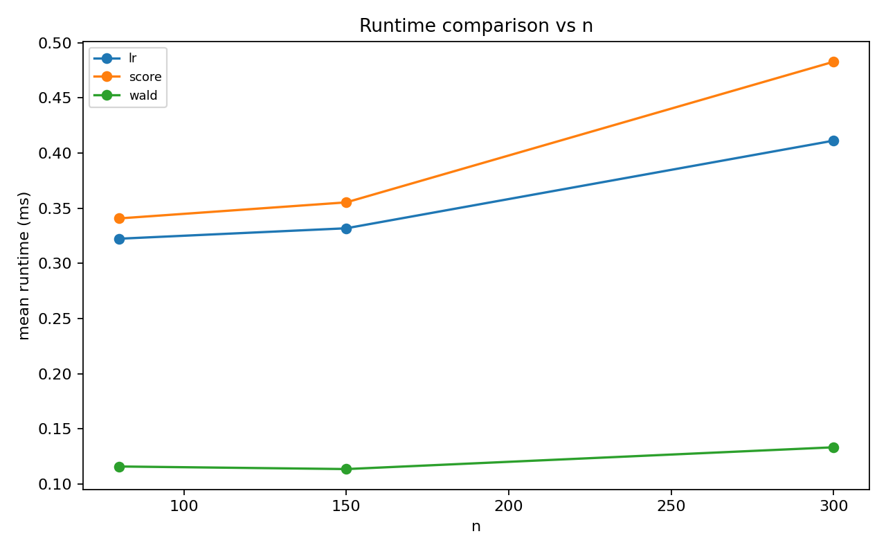

# Wald / Score / LR シミュレーション教材レポート

- alpha: 0.05
- total rows: 8100

## Practical: Wald batch speed for many hypotheses

- slug: `wald_runtime_batch`
- notes: 多数係数を順次検定する実務想定。1回のfull推定を再利用できるWaldはLR/Scoreより高速になりやすい。
- beta_1: H0: beta_1 = 0 (df=1)
- beta_2: H0: beta_2 = 0 (df=1)
- beta_3: H0: beta_3 = 0 (df=1)
- beta_4: H0: beta_4 = 0 (df=1)
- beta_5: H0: beta_5 = 0 (df=1)
- beta_6: H0: beta_6 = 0 (df=1)
- beta_7: H0: beta_7 = 0 (df=1)
- beta_8: H0: beta_8 = 0 (df=1)
- beta_9: H0: beta_9 = 0 (df=1)
- beta_10: H0: beta_10 = 0 (df=1)

### Summary

| test_label | size | power_at_max_effect | failure_rate | mean_runtime_ms |
| --- | --- | --- | --- | --- |
| lr | 0.069 | 0.526 | 0.000 | 0.355 |
| score | 0.069 | 0.522 | 0.000 | 0.393 |
| wald | 0.069 | 0.526 | 0.000 | 0.121 |

### Interpretation

多数仮説の同時処理では、Waldがfull推定再利用できるため平均runtimeで有利になりやすい設定です。

### Figures

- 
- 
- 
- 
- 
