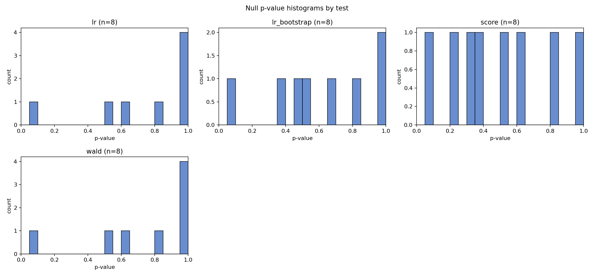
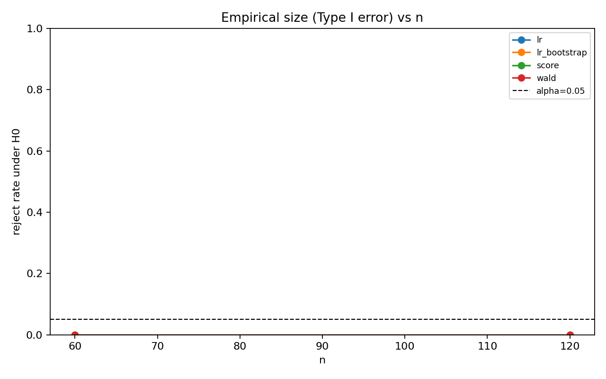
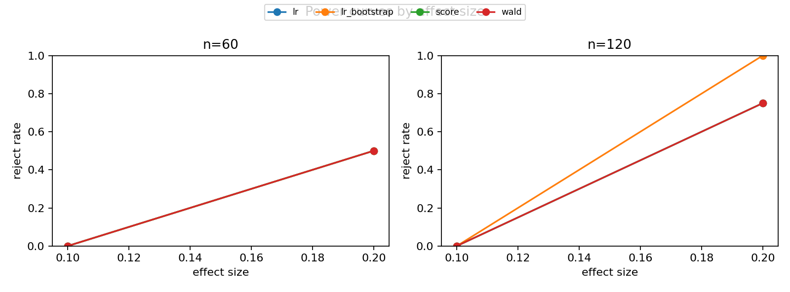
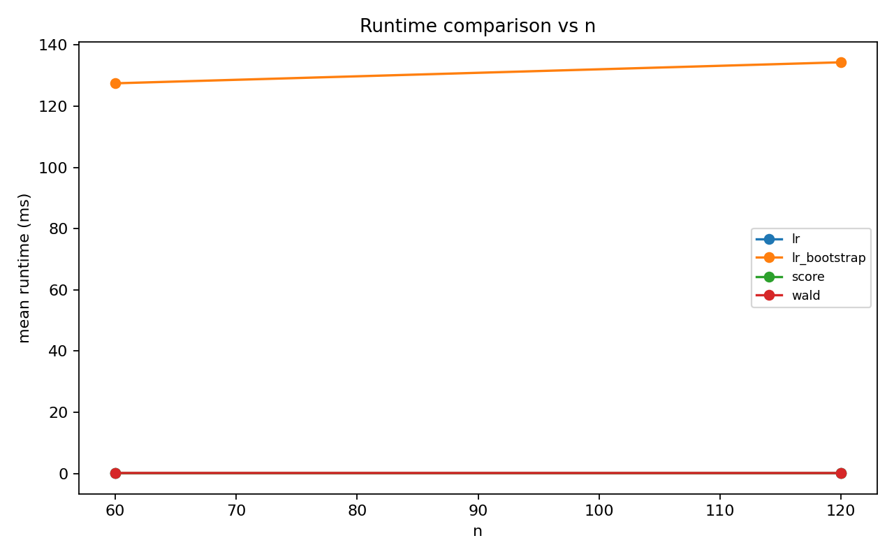

# Wald / Score / LR シミュレーション教材レポート

- alpha: 0.05
- total rows: 96

## Non-regular: ZIP boundary H0: pi=0

- slug: `zip_boundary`
- notes: 境界仮説でχ²近似が壊れ、Wald/Score/LRすべてサイズが歪み得る。LRのparametric bootstrapで校正可能。
- main: H0: pi = 0 (boundary) (df=1)

### Summary

| test_label | size | power_at_max_effect | failure_rate | mean_runtime_ms |
| --- | --- | --- | --- | --- |
| lr | 0.000 | 0.625 | 0.000 | 0.057 |
| lr_bootstrap | 0.000 | 0.750 | 0.000 | 130.919 |
| score | 0.000 | 0.625 | 0.000 | 0.103 |
| wald | 0.000 | 0.625 | 0.000 | 0.145 |

### Interpretation

境界仮説では通常のχ²近似が当てはまりにくく、サイズがalphaからずれます。 `lr_bootstrap` のサイズが他よりalphaに近ければ、校正の有効性が確認できます。

### Figures

- 
- 
- 
- 
- 
