# Wald / Score / LR シミュレーション教材レポート

- alpha: 0.05
- total rows: 2200

## Misspecification: Linear regression heteroskedastic

- slug: `linear_regression_heteroskedastic`
- notes: Heteroskedastic errors violate the constant-variance likelihood assumption, so nominal size can drift for Wald/Score/LR under the homoskedastic model. HC3-robust Wald can partially recover calibration.
- main: H0: beta_1 = 0 (df=1)

### Summary

| test_label | size | power_at_max_effect | failure_rate | mean_runtime_ms |
| --- | --- | --- | --- | --- |
| lr | 0.190 | 0.500 | 0.000 | 0.266 |
| score | 0.190 | 0.500 | 0.000 | 0.200 |
| wald | 0.210 | 0.500 | 0.000 | 0.217 |
| wald_hc3 | 0.050 | 0.270 | 0.000 | 0.303 |

### Interpretation

n増加で3検定が近づくか、または設定由来の不安定性がどの検定に出るかを確認できます。

### Figures

- 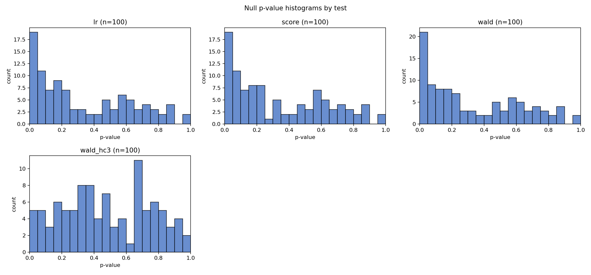
- 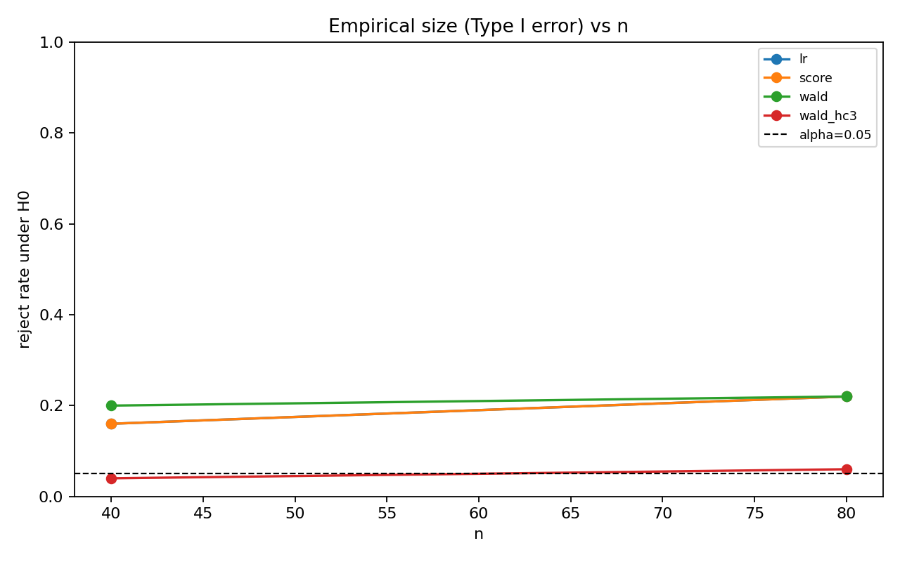
- 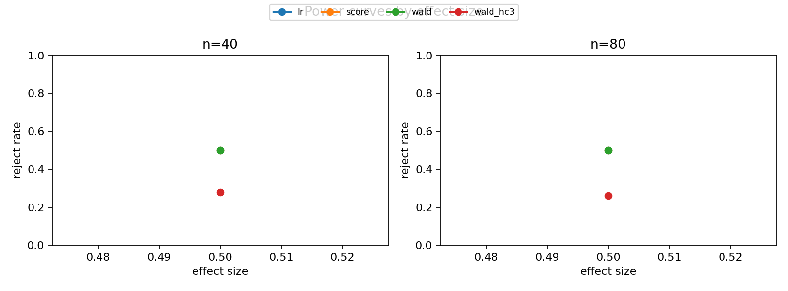
- 
- 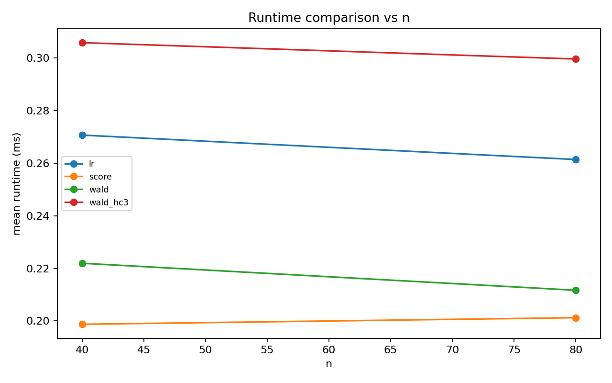

## Dependence: Logistic with clustered outcomes

- slug: `logistic_clustered`
- notes: Clustered dependence violates the independent-observation information matrix, so naive Wald/Score/LR under an iid logit can over-reject. Cluster-robust Wald can improve size calibration.
- main: H0: beta_1 = 0 (df=1)

### Summary

| test_label | size | power_at_max_effect | failure_rate | mean_runtime_ms |
| --- | --- | --- | --- | --- |
| lr | 0.040 | 0.330 | 0.000 | 1.694 |
| score | 0.040 | 0.310 | 0.000 | 0.855 |
| wald | 0.040 | 0.290 | 0.000 | 1.002 |
| wald_cluster | 0.100 | 0.290 | 0.000 | 1.164 |

### Interpretation

n増加で3検定が近づくか、または設定由来の不安定性がどの検定に出るかを確認できます。

### Figures

- 
- 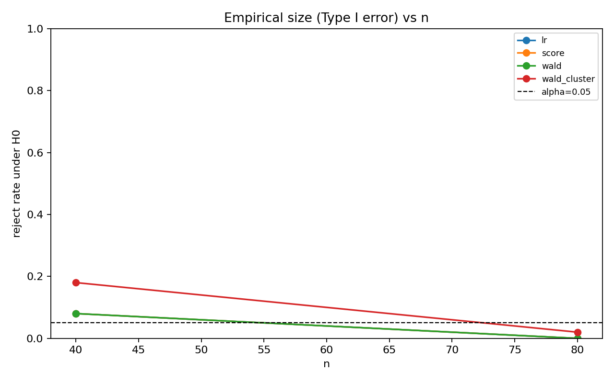
- 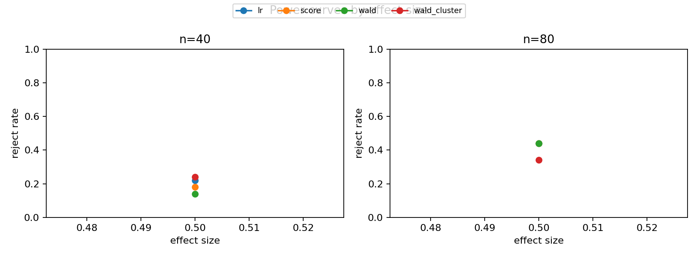
- 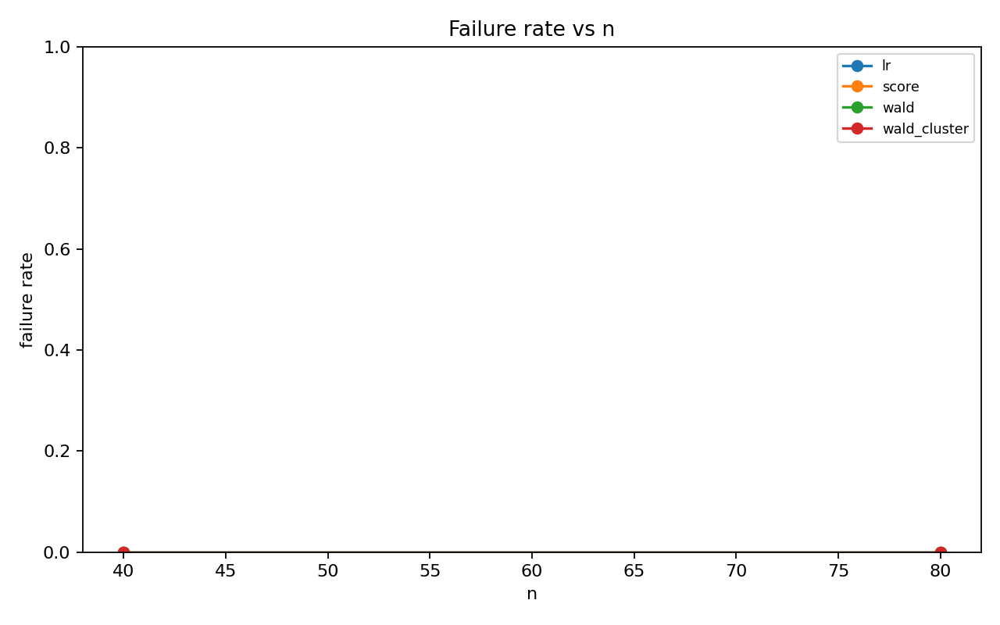
- 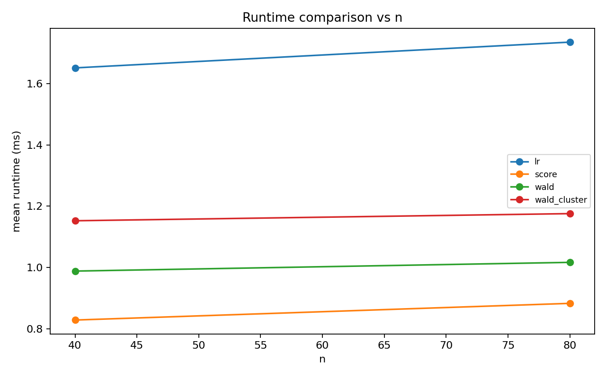

## Local alternatives: Logistic beta=c/sqrt(n)

- slug: `logistic_local_alternatives`
- notes: This scenario sets beta_1=c/sqrt(n), so power grows more slowly than fixed-effect alternatives. Finite-sample differences among Wald/Score/LR can remain visible before asymptotic agreement dominates.
- main: H0: beta_1 = 0 (df=1)

### Summary

| test_label | size | power_at_max_effect | failure_rate | mean_runtime_ms |
| --- | --- | --- | --- | --- |
| lr | 0.040 | 0.070 | 0.000 | 1.740 |
| score | 0.040 | 0.060 | 0.000 | 0.877 |
| wald | 0.040 | 0.050 | 0.000 | 1.034 |

### Interpretation

n増加で3検定が近づくか、または設定由来の不安定性がどの検定に出るかを確認できます。

### Figures

- 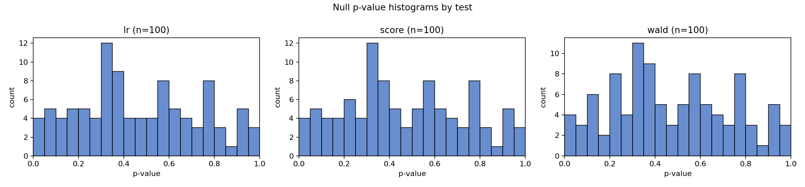
- 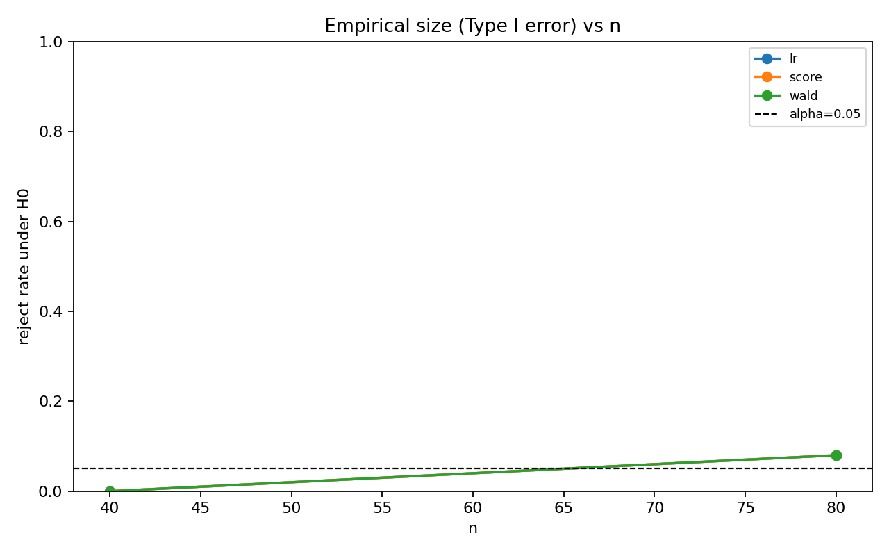
- 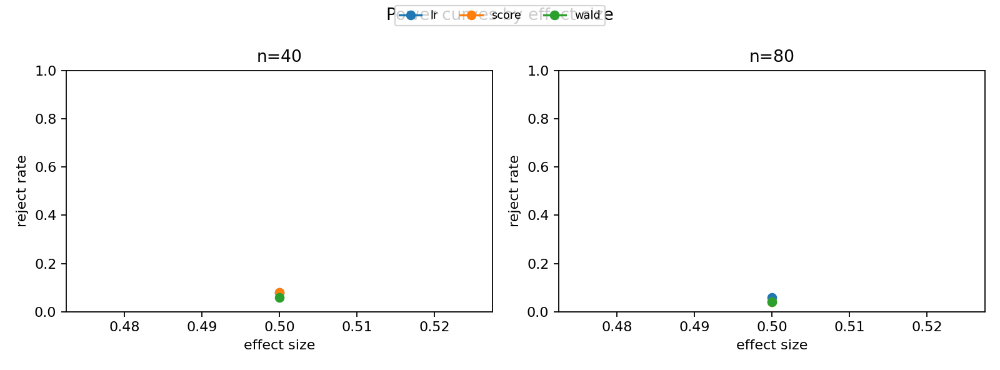
- 
- 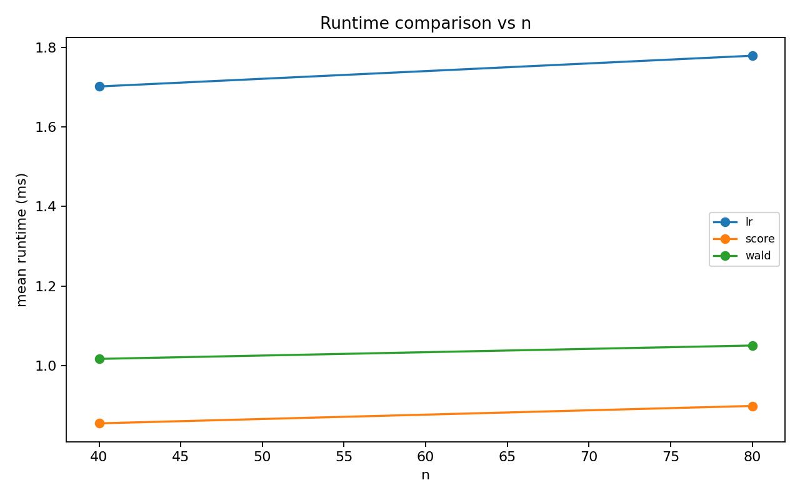
